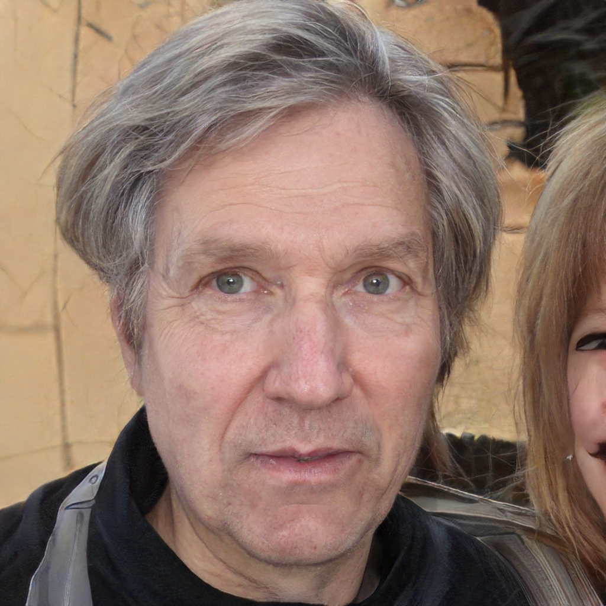
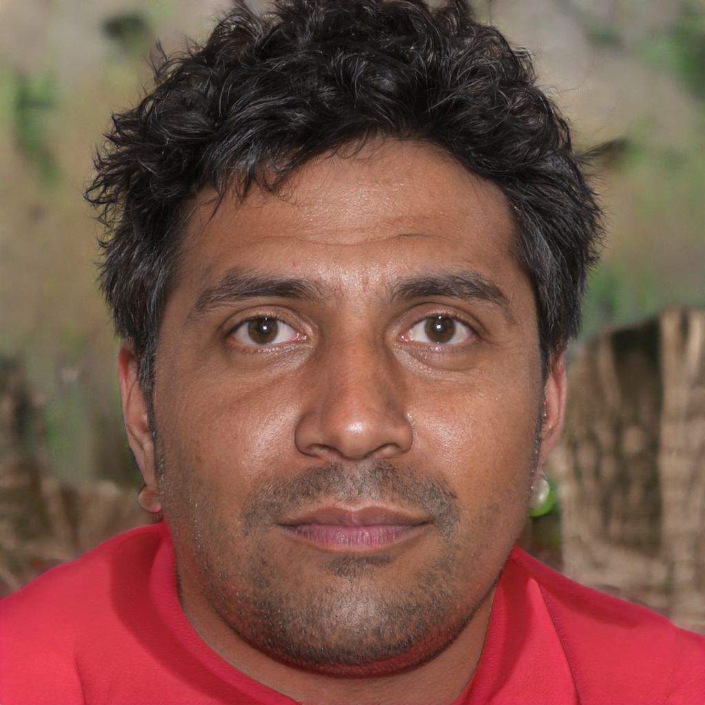

import apiOfflineNotice from '/snippets/api-offline-notice.mdx';

<apiOfflineNotice />

## Request

- **URL**: `https://www.ailabapi.com/api/portrait/analysis/skin-analysis-pro`
- **Method**: `POST`
- **Content-Type**: `multipart/form-data`

### Image requirements

- **Image format**: `JPG` `JPEG`
- **Image size**: No more than 8 MB.
- **Image resolution**: Larger than 200x200px, smaller than 4096x4096px.
- **Minimum face pixel size**: To ensure the effect, the minimum value of the face box (square) side length in the image should preferably be higher than 400px.
- **Face quality**: The higher the face quality, the more accurate the skin analysis. Factors affecting face quality include: occlusion of facial features, blurred images, improper lighting (bright, dark, backlight), excessive face angle (yaw ≤ ±30°, pitch ≤ ±40° recommended), etc.

### Headers

| Field              | Required | Type     | Description                                        |
|:-------------------|:---------|:---------|:---------------------------------------------------|
| `ailabapi-api-key` | YES      | `string` | Application API KEY. [Get API KEY](/docs/get-api-key) |

### Body

| Field                 | Required | Type          | Scope                                                                                                                                                                                                                                                                                                                                                                                                                                                                                                                                                  | Description                                                                                                                                                             |
|:----------------------|:---------|:--------------|:-------------------------------------------------------------------------------------------------------------------------------------------------------------------------------------------------------------------------------------------------------------------------------------------------------------------------------------------------------------------------------------------------------------------------------------------------------------------------------------------------------------------------------------------------------|:------------------------------------------------------------------------------------------------------------------------------------------------------------------------|
| `image`               | YES      | `file`        |                                                                                                                                                                                                                                                                                                                                                                                                                                                                                                                                                        | Main Image.                                                                                                                                                             |
| `left_side_image`     | NO       | `file`        |                                                                                                                                                                                                                                                                                                                                                                                                                                                                                                                                                        | Side face picture.                                                                                                                                                      |
| `right_side_image`    | NO       | `file`        |                                                                                                                                                                                                                                                                                                                                                                                                                                                                                                                                                        | Side face picture.                                                                                                                                                      |
| `return_maps`         | NO       | `string`      | ``red_area``, ``brown_area``, ``texture_enhanced_pores``, ``texture_enhanced_blackheads``, ``texture_enhanced_oily_area``, ``texture_enhanced_lines``, ``water_area``, ``rough_area``, ``roi_outline_map``, ``texture_enhanced_bw`` | Input a comma-separated string containing the types of skin problem detection map images to be returned. (#return_maps)                                   |
| `return_marks`        | NO       | `string`      | ``wrinkle_mark``, ``right_nasolabial_list``, ``right_mouth_list``, ``right_eye_wrinkle_list``, ``right_crowsfeet_list``, ``right_cheek_list``, ``left_nasolabial_list``, ``left_mouth_list``, ``left_eye_wrinkle_list``, ``left_crowsfeet_list``, ``left_cheek_list``, ``glabella_wrinkle_list``, ``forehead_wrinkle_list``, ``dark_circle_outline``, ``sensitivity_mark``, ``melanin_mark``, ``dark_circle_outline``, ``cheekbone_mark`` | Return the coordinates of the problem areas along with other information. Separate multiple information fields with commas. (#return_marks)               |
| `roi_outline_color`   | NO       | `json string` |                                                                                                                                                                                                                                                                                                                                                                                                                                                                                                                                                        | Customize the drawing colors for the problem areas in the image returned by `return_maps`. [More Details](#roi_outline_color)                                           |
| `return_side_results` | NO       | `string`      | ``jawline_info`` | To return the side profile information, you need to upload a side profile image. Separate multiple information fields with commas. (#return_side_results) |

#### `return_maps` 

- **Request Example**

  `red_area,brown_area,texture_enhanced_pores,texture_enhanced_blackheads,texture_enhanced_oily_area,texture_enhanced_lines,water_area,rough_area,roi_outline_map,texture_enhanced_bw`

- **Field Parsing**

| Field                         | Description                                                                                                             | Return image information                                                                                                                                                     |
|:------------------------------|:------------------------------------------------------------------------------------------------------------------------|:-----------------------------------------------------------------------------------------------------------------------------------------------------------------------------|
| `red_area`                    | The red area image displays regions of facial redness caused by sensitivity or inflammation.                            | White background red area image, where the depth of the red color indicates the level of sensitivity.                                                                        |
| `brown_area`                  | The brown area image displays regions of facial pigmentation.                                                           | White background brown area image, where the depth of the brown color indicates the level of pigmentation.                                                                   |
| `texture_enhanced_pores`      | The enlarged pores area image of the face.                                                                              | Transparent background PNG, annotating enlarged pore areas. The image size is the same as the original, allowing for overlay and comparison with the original image.         |
| `texture_enhanced_blackheads` | The blackhead area image of the face.                                                                                   | Transparent background PNG, annotating blackhead areas. The image size is the same as the original, allowing for overlay and comparison with the original image.             |
| `texture_enhanced_oily_area`  | The oily areas image of the face                                                                                        | Transparent background PNG, annotating facial oily areas. The image size is the same as the original, allowing for overlay and comparison with the original image.           |
| `texture_enhanced_lines`      | The facial texture image highlights prominent deep and shallow wrinkles on the face.                                    | Transparent background PNG, annotating facial wrinkles. The image size is the same as the original, allowing for overlay and comparison with the original image.             |
| `water_area`                  | The facial moisture image shows areas of dryness on the face. Darker blue indicates greater levels of skin dehydration. | White background PNG, annotating facial dryness areas. The image size is the same as the original.                                                                           |
| `rough_area`                  | The facial roughness image displays areas of roughness on the face.                                                     | White background PNG, annotating facial roughness areas. The image size is the same as the original.                                                                         |
| `roi_outline_map`             | The image for plotting coordinates of facial spots and acne                                                             | Transparent background PNG, annotating facial spots and acne areas. The image size is the same as the original, allowing for overlay and comparison with the original image. |
| `texture_enhanced_bw`         | The black-and-white enhanced image for facial blackheads and enlarged pores                                             | JPG, with cropping. The API returns coordinates and cropping ratios, which can be mapped to pixel coordinates in the original image.                                         |

#### `return_marks` 

- **Request Example**

  `wrinkle_mark,right_nasolabial_list,right_mouth_list,right_eye_wrinkle_list,right_crowsfeet_list,right_cheek_list,left_nasolabial_list,left_mouth_list,left_eye_wrinkle_list,left_crowsfeet_list,left_cheek_list,glabella_wrinkle_list,forehead_wrinkle_list,dark_circle_outline,sensitivity_mark,melanin_mark,dark_circle_outline,cheekbone_mark`

- **Field Parsing**

| Field                    | Description                                                                                              |
|:-------------------------|:---------------------------------------------------------------------------------------------------------|
| `wrinkle_mark`           | Contour coordinates for the facial areas: forehead, nose, crow's feet, cheeks, and between the eyebrows. |
| `right_nasolabial_list`  | Coordinates, depth, and length of the right nasolabial fold wrinkles.                                    |
| `right_mouth_list`       | Coordinates, depth, and length of the right mouth corner wrinkles.                                       |
| `right_eye_wrinkle_list` | Coordinates, depth, and length of the right eye area wrinkles.                                           |
| `right_crowsfeet_list`   | Coordinates, depth, and length of the right eye area crow's feet wrinkles.                               |
| `right_cheek_list`       | Coordinates, depth, and length of the right cheek wrinkles.                                              |
| `left_nasolabial_list`   | Coordinates, depth, and length of the left nasolabial fold wrinkles.                                     |
| `left_mouth_list`        | Coordinates, depth, and length of the left mouth corner wrinkles.                                        |
| `left_eye_wrinkle_list`  | Coordinates, depth, and length of the left eye area wrinkles.                                            |
| `left_crowsfeet_list`    | Coordinates, depth, and length of the left eye area crow's feet wrinkles.                                |
| `left_cheek_list`        | Coordinates, depth, and length of the left cheek wrinkles.                                               |
| `glabella_wrinkle_list`  | Coordinates, depth, and length of the wrinkles between the eyebrows.                                     |
| `forehead_wrinkle_list`  | Coordinates, depth, and length of the forehead wrinkles.                                                 |
| `dark_circle_outline`    | Coordinates of the contour lines for dark circles under the left and right eyes.                         |
| `sensitivity_mark`       | Coordinates of the red areas, indicating regions of facial redness due to sensitivity or inflammation.   |
| `melanin_mark`           | Coordinates of the pigmentation areas, indicating regions of facial pigmentation.                        |
| `dark_circle_outline`    | Coordinates of the contour lines for dark circles under the left and right eyes.                         |
| `cheekbone_mark`         | Coordinates of the facial apple cheeks.                                                                  |

#### `roi_outline_color` 

- **Request Example**

  ``

- **Field Parsing**

| Field                    | Default  | Description                                                                        |
|:-------------------------|:---------|:-----------------------------------------------------------------------------------|
| `pores_color`            | `0000FF` | Pore Color: Draw the `return_maps > texture_enhanced_pores` issue image.           |
| `blackhead_color`        | `FF0000` | Blackhead Color: Draw the `return_maps > texture_enhanced_blackheads` issue image. |
| `wrinkle_color`          | `6E9900` | Deep Wrinkle Color: Draw the `return_maps > texture_enhanced_lines` issue image.   |
| `fine_line_color`        | `8DFE2A` | Fine Wrinkle Color: Draw the `return_maps > texture_enhanced_lines` issue image.   |
| `closed_comedones_color` | `00FF00` | Closed Comedone Color: Draw the `return_maps > roi_outline_map` issue image.       |
| `acne_pustule_color`     | `9F21F6` | Pustule Color: Draw the `return_maps > roi_outline_map` issue image.               |
| `acne_nodule_color`      | `FF00FD` | Nodule Color: Draw the `return_maps > roi_outline_map` issue image.                |
| `acne_color`             | `FE0100` | Papule Color: Draw the `return_maps > roi_outline_map` issue image.                |
| `brown_spot_color`       | `7E2A28` | Pigmentation Color: Draw the `return_maps > roi_outline_map` issue image.          |

Example: The format `CC00FF` represents the following RGB values:

- **R (Red)**: CC (204 in decimal)
- **G (Green)**: 00 (0 in decimal)
- **B (Blue)**: FF (255 in decimal)

The input format is restricted to a 6-digit hexadecimal string, case-insensitive.

If no modifications are made, the default color parameters will be used for drawing.

#### `return_side_results` 

- **Request Example**

  `jawline_info`

- **Field Parsing**

| Field          | Description                                                                                                                                                                                                                                                                                                                                                        |
|:---------------|:-------------------------------------------------------------------------------------------------------------------------------------------------------------------------------------------------------------------------------------------------------------------------------------------------------------------------------------------------------------------|
| `jawline_info` | If you provide the `jawline_info` element and upload images of both the left and right profiles, the corresponding side profile results will be returned. These results can include fields such as profile image quality assessment, jawline angle, and jawline coordinates, which will be available in the `left_side_result` and `right_side_result` structures. |

## Response

**Response Field Handling Flow**

1. **Handle `Public Response Fields`**

   Parse and validate the `Public Response Fields`, checking the status code or response message to ensure the request is successful and error-free.

2. **Handle `Business Response Fields`**

   If the `Public Response Fields` are valid and error-free, proceed with processing the business logic in the `Business Response Fields`.

### Public Response Fields

<a href="/docs/response-description" target="_blank">Viewing Public Response Fields and Error Codes</a>

### Business Response Fields

| Field               | Type          | Description                                                              |
|:--------------------|:--------------|:-------------------------------------------------------------------------|
| `left_side_result`  | `json string` | Results of the side profile analysis. [More Details](#left_side_result)  |
| `right_side_result` | `json string` | Results of the side profile analysis. [More Details](#right_side_result) |
| `face_rectangle`    | `object`      | The position of the face rectangle box. [More Details](#face_rectangle)  |
| `result`            | `object`      | Results of the facial skin analysis. [More Details](#result)             |

#### `left_side_result` 

| Field                        | Type      | Scope                                                                         | Description                                                                                                                                                                                                                                                                                                                                                                                                                                                                                     |
|:-----------------------------|:----------|:------------------------------------------------------------------------------|:------------------------------------------------------------------------------------------------------------------------------------------------------------------------------------------------------------------------------------------------------------------------------------------------------------------------------------------------------------------------------------------------------------------------------------------------------------------------------------------------|
| +`left_jawline_info`         | `object`  |                                                                               | Side profile jawline information.                                                                                                                                                                                                                                                                                                                                                                                                                                                               |
| ++`left_jawline_quality`     | `integer` | ``1``, ``2``, ``3``, ``4``, ``5``, ``6`` | Side profile photo quality assessment. ``1`: Quality Pass. The side profile angle of the uploaded photo is between 20° and 120°. `left_jawline_angle` and `left_jawline_mark` fields will also be returned.` ``2`: Slightly Low Angle. The side profile angle of the photo is less than 20°.` ``3`: Slightly High Angle. The side profile angle of the photo is greater than 120°.` ``4`: No Face Detected.` ``5`: Invalid Face.` ``6`: Other Cases.` |
| ++`left_jawline_angle`       | `float`   |                                                                               | The angle of the jawline.                                                                                                                                                                                                                                                                                                                                                                                                                                                                       |
| ++`left_jawline_mark`        | `array`   |                                                                               | Coordinates of the facial keypoints for the jawline.                                                                                                                                                                                                                                                                                                                                                                                                                                            |
| ++`left_jawline_angle_level` | `integer` | ``0``, ``1`` | Standard degree of the jawline. ``0`: Standard (116°–120°)` ``1`: Not Standard`                                                                                                                                                                                                                                                                                                                                                                                                   |

#### `right_side_result` 

| Field                         | Type      | Scope                                                                         | Description                                                                                                                                                                                                                                                                                                                                                                                                                                                                                       |
|:------------------------------|:----------|:------------------------------------------------------------------------------|:--------------------------------------------------------------------------------------------------------------------------------------------------------------------------------------------------------------------------------------------------------------------------------------------------------------------------------------------------------------------------------------------------------------------------------------------------------------------------------------------------|
| +`right_jawline_info`         | `object`  |                                                                               | Side profile jawline information.                                                                                                                                                                                                                                                                                                                                                                                                                                                                 |
| ++`right_jawline_quality`     | `integer` | ``1``, ``2``, ``3``, ``4``, ``5``, ``6`` | Side profile photo quality assessment. ``1`: Quality Pass. The side profile angle of the uploaded photo is between 20° and 120°. `right_jawline_angle` and `right_jawline_mark` fields will also be returned.` ``2`: Slightly Low Angle. The side profile angle of the photo is less than 20°.` ``3`: Slightly High Angle. The side profile angle of the photo is greater than 120°.` ``4`: No Face Detected.` ``5`: Invalid Face.` ``6`: Other Cases.` |
| ++`right_jawline_angle`       | `float`   |                                                                               | The angle of the jawline.                                                                                                                                                                                                                                                                                                                                                                                                                                                                         |
| ++`right_jawline_mark`        | `array`   |                                                                               | Coordinates of the facial keypoints for the jawline.                                                                                                                                                                                                                                                                                                                                                                                                                                              |
| ++`right_jawline_angle_level` | `integer` | ``0``, ``1`` | Standard degree of the jawline. ``0`: Standard (116°–120°)` ``1`: Not Standard`                                                                                                                                                                                                                                                                                                                                                                                                     |

#### `face_rectangle` 

| Field     | Type    | Description                                                             |
|:----------|:--------|:------------------------------------------------------------------------|
| +`top`    | `float` | The vertical coordinate of the top-left pixel of the rectangular box.   |
| +`left`   | `float` | The horizontal coordinate of the top-left pixel of the rectangular box. |
| +`width`  | `float` | The width of the rectangular box.                                       |
| +`height` | `float` | The height of the rectangular box.                                      |

#### `result` 

| Modules                                                         | Field                                                                                                                                                                                                                                                                                                                                                                                                                                                                                                                                                                                                                                                                                                                                                                                                                                                                                                                                                                                                                                                                                                                                                                                                   |
|:----------------------------------------------------------------|:--------------------------------------------------------------------------------------------------------------------------------------------------------------------------------------------------------------------------------------------------------------------------------------------------------------------------------------------------------------------------------------------------------------------------------------------------------------------------------------------------------------------------------------------------------------------------------------------------------------------------------------------------------------------------------------------------------------------------------------------------------------------------------------------------------------------------------------------------------------------------------------------------------------------------------------------------------------------------------------------------------------------------------------------------------------------------------------------------------------------------------------------------------------------------------------------------------|
| [Image Quality Module](#image_quality_module)                   | ``image_quality`` |
| [Skin Quality Analysis Module](#skin_quality_analysis_module)   | ``skin_type``, ``oily_intensity``, ``water`` |
| [Skin Tone Analysis Module](#skin_tone_analysis_module)         | ``skintone``, ``skintone_ita``, ``skin_hue_ha`` |
| [Roughness Analysis Module](#roughness_analysis_module)         | ``blackhead``, ``blackhead_count``, ``enlarged_pore_count``, ``pores_forehead``, ``pores_right_cheek``, ``pores_left_cheek``, ``pores_jaw``, ``rough`` |
| [Pigmentation Analysis Module](#pigmentation_analysis_module)   | ``melanin``, ``melanin_mark``, ``mole``, ``brown_spot``, ``melasma``, ``freckle`` |
| [Acne Analysis Module](#acne_analysis_module)                   | ``acne``, ``acne_pustule``, ``acne_nodule``, ``acne_mark``, ``closed_comedones`` |
| [Sensitivity Analysis Module](#sensitivity_analysis_module)     | ``sensitivity``, ``sensitivity_mark`` |
| [Aging Analysis Module](#aging_analysis_module)                 | ``skin_age``, ``forehead_wrinkle``, ``crows_feet``, ``eye_finelines``, ``glabella_wrinkle``, ``nasolabial_fold``, ``nasolabial_fold_severity``, ``left_mouth_wrinkle_severity``, ``right_mouth_wrinkle_severity``, ``forehead_wrinkle_severity``, ``left_crows_feet_severity``, ``right_crows_feet_severity``, ``left_eye_finelines_severity``, ``right_eye_finelines_severity``, ``glabella_wrinkle_severity``, ``left_nasolabial_fold_severity``, ``right_nasolabial_fold_severity``, ``left_cheek_wrinkle_severity``, ``right_cheek_wrinkle_severity``, ``fine_line``, ``wrinkle_count``, ``forehead_wrinkle_info``, ``left_eye_wrinkle_info``, ``right_eye_wrinkle_info``, ``left_crowsfeet_wrinkle_info``, ``right_crowsfeet_wrinkle_info``, ``glabella_wrinkle_info``, ``left_mouth_wrinkle_info``, ``right_mouth_wrinkle_info``, ``left_nasolabial_wrinkle_info``, ``right_nasolabial_wrinkle_info``, ``left_cheek_wrinkle_info``, ``right_cheek_wrinkle_info``, ``cheekbone_mark`` |
| [Eye Analysis Module](#eye_analysis_module)                     | ``eye_pouch``, ``eye_pouch_severity``, ``left_eye_pouch_rectangle``, ``right_eye_pouch_rectangle``, ``dark_circle``, ``dark_circle_severity``, ``left_dark_circle_rete``, ``right_dark_circle_rete``, ``left_dark_circle_pigment``, ``right_dark_circle_pigment``, ``left_dark_circle_structural``, ``right_dark_circle_structural``, ``dark_circle_mark``, ``left_eye_pouch_rect``, ``right_eye_pouch_rect``, ``wrinkle_mark``, ``dark_circle_mark`` |
| [Digital Scoring System Module](#digital_scoring_system_module) | ``score_info`` |
| [Custom Module](#custom_module)                                 | ``enhanced_bw_info``, ``face_maps`` |

##### Image Quality Module 

It returns the proportion of the face in the image, face coordinates, face angle values, and the proportion of bangs. The face coordinates can be used to extract the face for custom interactive design.

The face proportion in the image, face angle values, and bangs proportion can be used as custom restrictions to determine whether the uploaded image is acceptable. For example, if the bangs proportion exceeds 0.4, the image needs to be retaken. If you have no special requirements, you can directly use the default configuration of the interface.

| Field                | Type          | Scope                     | Description                                                                                                                                 |
|:---------------------|:--------------|:--------------------------|:--------------------------------------------------------------------------------------------------------------------------------------------|
| +`image_quality`     | `json string` |                           |                                                                                                                                             |
| ++`face_ratio`       | `float`       | [0, 1]                    | The proportion of the face in the entire photo: the larger the value, the greater the proportion of the face. The default threshold is 0.5. |
| ++`face_orientation` | `object`      |                           | Face 3D angle.                                                                                                                              |
| +++`yaw`             | `float`       |                           | Yaw angle. The angle of rotation around the Y-axis. It is expressed as the horizontal rotation of the head to the left or right.            |
| +++`pitch`           | `float`       |                           | Pitch angle. The angle of rotation around the X-axis. Expressed as head pitch and tilt.                                                     |
| +++`roll`            | `float`       |                           | Scroll angle. The angle of rotation around the Z axis, expressed as the rotation of the face photo seen from the front.                     |
| ++`face_rect`        | `float`       |                           | The coordinates of the face can be obtained based on facial key points, allowing the face to be extracted.                                  |
| +++`top`             | `float`       |                           |                                                                                                                                             |
| +++`left`            | `float`       |                           |                                                                                                                                             |
| +++`width`           | `float`       |                           |                                                                                                                                             |
| +++`height`          | `float`       |                           |                                                                                                                                             |
| ++`hair_occlusion`   | `float`       | [0, 1]                    | The proportion of bangs on the face: the larger the value, the greater the proportion of bangs.                                             |
| ++`glasses`          | `integer`     | ``0``, ``1`` | ``0`: No eyeglasses were worn.` ``1`: Wearing eyeglasses.`                                                                    |

##### Skin Quality Analysis Module 

It analyzes the skin's oil-dryness index. `skin_type` serves as an overall classification to determine the user's skin type, while `oily_intensity` and `water` analyze the current state of the user's skin in terms of moisture level and oiliness.

| Field                | Type      | Scope                                               | Description                                                                                                                                           |
|:---------------------|:----------|:----------------------------------------------------|:------------------------------------------------------------------------------------------------------------------------------------------------------|
| +`skin_type`         | `object`  |                                                     | Skin texture test results.                                                                                                                            |
| ++`skin_type`        | `integer` | ``0``, ``1``, ``2``, ``3`` | Type. ``0`: Oily skin.` ``1`: Dry skin.` ``2`: Neutral skin.` ``3`: Combination skin.`                                    |
| ++`details`          | `object`  |                                                     | The confidence level of each classification.                                                                                                          |
| +++`0`               | `object`  |                                                     | Oily skin information.                                                                                                                                |
| ++++`value`          | `integer` | ``0``, ``1`` | Oily skin. ``0`: No.` ``1`: Yes.`                                                                                                       |
| ++++`confidence`     | `float`   |                                                     | Confidence.                                                                                                                                           |
| +++`1`               | `object`  |                                                     | Dry skin information.                                                                                                                                 |
| ++++`value`          | `integer` | ``0``, ``1`` | Dry skin. ``0`: No.` ``1`: Yes.`                                                                                                        |
| ++++`confidence`     | `float`   |                                                     | Confidence.                                                                                                                                           |
| +++`2`               | `object`  |                                                     | Neutral skin information.                                                                                                                             |
| ++++`value`          | `integer` | ``0``, ``1`` | Neutral skin. ``0`: No.` ``1`: Yes.`                                                                                                    |
| ++++`confidence`     | `float`   |                                                     | Confidence.                                                                                                                                           |
| +++`3`               | `object`  |                                                     | Combination skin information.                                                                                                                         |
| ++++`value`          | `integer` | ``0``, ``1`` | Combination skin. ``0`: No.` ``1`: Yes.`                                                                                                |
| ++++`confidence`     | `float`   |                                                     | Confidence.                                                                                                                                           |
| +`oily_intensity`    | `object`  |                                                     | Oiliness level detection.                                                                                                                             |
| ++`t_zone`           | `object`  |                                                     | T-zone.                                                                                                                                               |
| +++`area`            | `object`  | [0, 1]                                              | Area share.                                                                                                                                           |
| +++`intensity`       | `integer` | ``0``, ``1``, ``2`` | Severity of oiling. ``0`: No shine or slight shine.` ``1`: Medium shine phenomenon.` ``2`: Severe oiling.`                       |
| ++`left_cheek`       | `object`  |                                                     | Left cheek.                                                                                                                                           |
| +++`area`            | `object`  | [0, 1]                                              | Area share.                                                                                                                                           |
| +++`intensity`       | `integer` | ``0``, ``1``, ``2`` | Severity of oiling. ``0`: No shine or slight shine.` ``1`: Medium shine phenomenon.` ``2`: Severe oiling.`                       |
| ++`right_cheek`      | `object`  |                                                     | Right cheek.                                                                                                                                          |
| +++`area`            | `object`  | [0, 1]                                              | Area share.                                                                                                                                           |
| +++`intensity`       | `integer` | ``0``, ``1``, ``2`` | Severity of oiling. ``0`: No shine or slight shine.` ``1`: Medium shine phenomenon.` ``2`: Severe oiling.`                       |
| ++`chin_area`        | `object`  |                                                     | Chin area.                                                                                                                                            |
| +++`area`            | `object`  | [0, 1]                                              | Area share.                                                                                                                                           |
| +++`intensity`       | `integer` | ``0``, ``1``, ``2`` | Severity of oiling. ``0`: No shine or slight shine.` ``1`: Medium shine phenomenon.` ``2`: Severe oiling.`                       |
| ++`full_face`        | `object`  |                                                     | Full face.                                                                                                                                            |
| +++`area`            | `object`  | [0, 1]                                              | Area share.                                                                                                                                           |
| +++`intensity`       | `integer` | ``0``, ``1``, ``2`` | Severity of oiling. ``0`: No shine or slight shine.` ``1`: Medium shine phenomenon.` ``2`: Severe oiling.`                       |
| +`water`             | `object`  |                                                     | The percentage of dehydrated skin on the forehead, cheeks and chin, the percentage of overall facial dehydrated area and the severity of dehydration. |
| ++`water_severity`   | `float`   | [0, 100]                                            | Severity of water shortage .                                                                                                                          |
| ++`water_area`       | `float`   |                                                     | Percentage of water deficit area .                                                                                                                    |
| ++`water_forehead`   | `object`  |                                                     | Percentage of forehead deficiency area.                                                                                                               |
| +++`area`            | `float`   | [0, 1]                                              | Area share.                                                                                                                                           |
| ++`water_rightcheek` | `object`  |                                                     | Percentage of dehydrated area on the right cheek.                                                                                                     |
| +++`area`            | `float`   | [0, 1]                                              | Area share.                                                                                                                                           |
| ++`water_leftcheek`  | `object`  |                                                     | Percentage of dehydrated area on the left cheek.                                                                                                      |
| +++`area`            | `float`   | [0, 1]                                              | Area share.                                                                                                                                           |

##### Skin Tone Analysis Module 

`skintone_ita` is an upgraded version of `skintone`. You can use either of the two, but it's recommended to use the combination of `skintone_ita` and `skin_hue_ha`.

| Field           | Type      | Scope                                                                                      | Description                                                                                                                                                                                                                                                                              |
|:----------------|:----------|:-------------------------------------------------------------------------------------------|:-----------------------------------------------------------------------------------------------------------------------------------------------------------------------------------------------------------------------------------------------------------------------------------------|
| +`skintone`     | `object`  |                                                                                            | Skin color test results.                                                                                                                                                                                                                                                                 |
| ++`value`       | `integer` | ``0``, ``1``, ``2``, ``3``, ``4`` | Skin color. ``0`: Very Light.` ``1`: Light.` ``2`: Intermediate.` ``3`: Tan.` ``4`: Brown/Dark.`                                                                                                                                                      |
| ++`confidence`  | `float`   | [0, 1]                                                                                     | Confidence.                                                                                                                                                                                                                                                                              |
| +`skintone_ita` | `object`  |                                                                                            | Returns skin color classification based on the ITA (Individual Typology Angle) standard. **[NOTE](#skintone_ita)**                                                                                                                                                                       |
| ++`ITA`         | `float`   | [-90, 90]                                                                                  | Angle value.                                                                                                                                                                                                                                                                             |
| ++`skintone`    | `integer` | ``0``, ``1``, ``2``, ``3``, ``4``, ``5``, ``6`` | Classified according to the skin tone of ITA. ``0`: Very light.` ``1`: Light.` ``2`: Intermediate.` ``3`: Tan.` ``4`: Brown.` ``5`: Dark.` ``6`: Abnormal color values that may be caused by weak lighting conditions or overexposure.` |
| +`skin_hue_ha`  | `object`  |                                                                                            | Returns skin tone classification based on the HA (Hue Angle) standard. **[NOTE](#skin_hue_ha)**                                                                                                                                                                                          |
| ++`HA`          | `float`   | [0, 90]                                                                                    | HA angle value.                                                                                                                                                                                                                                                                          |
| ++`skin_hue`    | `integer` | ``0``, ``1``, ``2``, ``3`` | Classified according to HA's skin tone hue. ``0`: Yellowish.` ``1`: Neutral.` ``2`: Reddish.` ``3`: Abnormal hue values may be caused by abnormal ambient light tones or weak light environment or overexposure.`                                            |

###### `skintone_ita` 

ITA (Individual Typology Angle) is an internationally recognized skin color standard. It classifies skin color based on measurements of color attributes in the Lab color space. This method is highly sensitive to ambient lighting conditions. For best results, we recommend using a flash to take high-definition photos of the face for processing. Measurements taken in natural or low-light conditions may be inaccurate or inconsistent.

Based on data from the smartphone's rear flash, the current skin color classification reference is as follows:

| `skintone` | Scope               | Description                                                                           |
|:-----------|:--------------------|:--------------------------------------------------------------------------------------|
| `0`        | 56 `<` ITA `<` 90   | Very light.                                                                           |
| `1`        | 43 `<` ITA `<=` 56  | Light.                                                                                |
| `2`        | 36 `<` ITA `<=` 43  | Intermediate.                                                                         |
| `3`        | 20 `<` ITA `<=` 36  | Tan.                                                                                  |
| `4`        | 10 `<` ITA `<=` 20  | Brown.                                                                                |
| `5`        | -90 `<` ITA `<=` 10 | Dark.                                                                                 |
| `6`        | Other               | Abnormal color values that may be caused by weak lighting conditions or overexposure. |

You can also use the returned ITA value to define your classification based on the returned ITA angle at the time of access.

###### `skin_hue_ha` 

HA (Hue Angle) is an internationally recognized skin color standard. It classifies skin color by measuring color attributes in the Lab color space. This method is highly sensitive to ambient lighting conditions. For accurate results, we recommend using a flash to take high-definition photos of the face for processing, as HA angle values measured in natural or low-light conditions may be inaccurate or inconsistent.

According to the data taken by the rear flash of the phone, the current skin tone classification reference.

| `skintone` | Scope             | Description                                                                                                  |
|:-----------|:------------------|:-------------------------------------------------------------------------------------------------------------|
| `0`        | 49 `<` HA `<=` 90 | Yellowish.                                                                                                   |
| `1`        | 46 `<=` HA `<` 49 | Neutral.                                                                                                     |
| `2`        | 10 `<=` HA `<` 46 | Reddish.                                                                                                     |
| `3`        | Other             | Abnormal hue values may be caused by abnormal ambient light tones or weak light environment or overexposure. |

You can also use the returned HA value to define your classification based on the returned HA angle at the time of access.

##### Roughness Analysis Module 

- `blackhead` indicates the severity of blackheads, while `blackhead_count` represents the number of blackheads.
- `enlarged_pore_count` is the count of enlarged pores.
- `pores_forehead`, `pores_rightcheek`, `pores_leftcheek`, and `pores_jaw` represent the severity of pores in different areas of the face. The overall severity of pores can be assessed based on the number or score of pores.
- `rough` measures the texture roughness of the facial skin and can provide the proportion of roughness across the entire face as well as the area proportion for different regions.

| Field                  | Type      | Scope                                               | Description                                                                                                                                                                                                                             |
|:-----------------------|:----------|:----------------------------------------------------|:----------------------------------------------------------------------------------------------------------------------------------------------------------------------------------------------------------------------------------------|
| +`blackhead`           | `object`  |                                                     | Blackhead information.                                                                                                                                                                                                                  |
| ++`value`              | `integer` | ``0``, ``1``, ``2``, ``3`` | ``0`: No blackheads, number of blackheads ∈ [0, 45].` ``1`: Mild, number of blackheads ∈ [46, 90].` ``2`: Moderate, number of blackheads ∈ [91, 150].` ``3`: Severe, number of blackheads ∈ [151 or more].` |
| ++`confidence`         | `float`   | [0, 1]                                              | Confidence.                                                                                                                                                                                                                             |
| +`blackhead_count`     | `integer` |                                                     | Number of blackheads on the nose area.                                                                                                                                                                                                  |
| +`enlarged_pore_count` | `object`  |                                                     | The number of enlarged pores and the percentage of enlarged pore area.                                                                                                                                                                  |
| ++`forehead_count`     | `object`  |                                                     | Number of enlarged pores on forehead.                                                                                                                                                                                                   |
| ++`left_cheek_count`   | `object`  |                                                     | Number of enlarged pores on the left cheek.                                                                                                                                                                                             |
| ++`right_cheek_count`  | `object`  |                                                     | Number of enlarged pores on the right cheek.                                                                                                                                                                                            |
| ++`chin_count`         | `object`  |                                                     | Number of enlarged pores under the chin.                                                                                                                                                                                                |
| +`pores_forehead`      | `object`  |                                                     | The severity of enlarged forehead pores.                                                                                                                                                                                                |
| ++`value`              | `integer` | ``0``, ``1``, ``2``, ``3`` | ``0`: No pores, number of pores ∈ [0, 100].` ``1`: Mildly, the number of pores ∈ [101, 300].` ``2`: Moderate, number of pores ∈ [301, 500].` ``3`: Severe, number of pores ∈ [501 or more].`                |
| ++`confidence`         | `float`   | [0, 1]                                              | Confidence.                                                                                                                                                                                                                             |
| +`pores_right_cheek`   | `object`  |                                                     | The severity of enlarged pores on the right cheek.                                                                                                                                                                                      |
| ++`value`              | `integer` | ``0``, ``1``, ``2``, ``3`` | ``0`: No pores, number of pores ∈ [0, 45].` ``1`: Mildly, the number of pores ∈ [46, 136].` ``2`: Moderate, number of pores ∈ [137, 227].` ``3`: Severe, number of pores ∈ [228 or more].`                  |
| ++`confidence`         | `float`   | [0, 1]                                              | Confidence.                                                                                                                                                                                                                             |
| +`pores_left_cheek`    | `object`  |                                                     | The severity of enlarged pores on the left cheek.                                                                                                                                                                                       |
| ++`value`              | `integer` | ``0``, ``1``, ``2``, ``3`` | ``0`: No pores, number of pores ∈ [0, 45].` ``1`: Mildly, the number of pores ∈ [46, 136].` ``2`: Moderate, number of pores ∈ [137, 227].` ``3`: Severe, number of pores ∈ [228 or more].`                  |
| ++`confidence`         | `float`   | [0, 1]                                              | Confidence.                                                                                                                                                                                                                             |
| +`pores_jaw`           | `object`  |                                                     | The severity of enlarged pores on the chin.                                                                                                                                                                                             |
| ++`value`              | `integer` | ``0``, ``1``, ``2``, ``3`` | ``0`: No pores, number of pores ∈ [0, 63].` ``1`: Mildly, the number of pores ∈ [64, 188].` ``2`: Moderate, number of pores ∈ [189, 313].` ``3`: Severe, number of pores ∈ [314 or more].`                  |
| ++`confidence`         | `float`   | [0, 1]                                              | Confidence.                                                                                                                                                                                                                             |
| +`rough`               | `object`  |                                                     | Output the percentage of rough skin area on forehead, cheeks and chin, the percentage of overall facial rough area and the severity of roughness.                                                                                       |
| ++`rough_severity`     | `integer` | [0, 100]                                            | Severity.                                                                                                                                                                                                                               |
| ++`rough_area`         | `float`   | [0, 1]                                              | Area share.                                                                                                                                                                                                                             |
| ++`rough_forehead`     | `object`  |                                                     | Forehead.                                                                                                                                                                                                                               |
| +++`area`              | `float`   | [0, 1]                                              | Area share.                                                                                                                                                                                                                             |
| ++`rough_rightcheek`   | `object`  |                                                     | Right cheek.                                                                                                                                                                                                                            |
| +++`area`              | `float`   | [0, 1]                                              | Area share.                                                                                                                                                                                                                             |
| ++`rough_leftcheek`    | `object`  |                                                     | Left cheek.                                                                                                                                                                                                                             |
| +++`area`              | `float`   | [0, 1]                                              | Area share.                                                                                                                                                                                                                             |
| ++`rough_jaw`          | `object`  |                                                     | Jaw.                                                                                                                                                                                                                                    |
| +++`area`              | `float`   | [0, 1]                                              | Area share.                                                                                                                                                                                                                             |

##### Pigmentation Analysis Module 

- `melanin` indicates the degree and area proportion of pigmentation on the face. The degree is represented by a score, with higher numbers indicating more severe pigmentation issues. The pigmentation score can be calculated using the `score_info > melanin_score` field.
- `melanin_mark` provides the coordinates of the pigmentation areas, which can be used to directly draw these areas.

If detailed results on specific pigmentation issues (such as moles or spots) are not required, you can use the overall pigmentation area drawing results. For detailed drawing of pigmentation issues, you can use the `mole` and `brown_spot` fields to get rectangular or polygonal bounding boxes.

| Field                     | Type      | Scope                     | Description                                                                                                                                                                |
|:--------------------------|:----------|:--------------------------|:---------------------------------------------------------------------------------------------------------------------------------------------------------------------------|
| +`melanin`                | `object`  |                           | Return the skin pigmentation of the human face in the photo.                                                                                                               |
| ++`brown_area`            | `float`   | [0, 1]                    | Percentage of full-face area of pigmented areas.                                                                                                                           |
| ++`melanin_concentration` | `float`   | [0, 100]                  | Degree of pigmentation.                                                                                                                                                    |
| ++`brown_forehead`        | `float`   | [0, 1]                    | Percentage of forehead hyperpigmentation area.                                                                                                                             |
| ++`brown_rightcheek`      | `float`   | [0, 1]                    | Percentage of hyperpigmented area on the right cheek.                                                                                                                      |
| ++`brown_leftcheek`       | `float`   | [0, 1]                    | Percentage of hyperpigmented area on the left cheek.                                                                                                                       |
| +`melanin_mark`           | `object`  |                           | Information on the pigmented areas of the brown area map.                                                                                                                  |
| ++`polygon`               | `array`   |                           | A collection of polygon coordinates within the brown area map, each polygon representing the x and y coordinate values of the outer contour line of a hyperpigmented area. |
| +++                       | `array`   |                           |                                                                                                                                                                            |
| ++++`x`                   | `float`   |                           |                                                                                                                                                                            |
| ++++`y`                   | `float`   |                           |                                                                                                                                                                            |
| +`mole`                   | `Object`  |                           | Information for each mole area.                                                                                                                                            |
| ++`rectangle`             | `array`   |                           | The position of each mole frame.                                                                                                                                           |
| +++`width`                | `float`   |                           | Width.                                                                                                                                                                     |
| +++`height`               | `float`   |                           | Height.                                                                                                                                                                    |
| +++`left`                 | `float`   |                           | The distance from the leftmost part of the picture.                                                                                                                        |
| +++`top`                  | `float`   |                           | The distance from the topmost edge of the image.                                                                                                                           |
| ++`confidence`            | `array`   |                           | The confidence level of each mole region.                                                                                                                                  |
| ++`polygon`               | `array`   |                           | Within each mole box, the more detailed polygon contour lines of the problem area, returning the x and y coordinate values of the vertices of each polygon mole area.      |
| +++                       | `array`   |                           |                                                                                                                                                                            |
| ++++`x`                   | `float`   |                           |                                                                                                                                                                            |
| ++++`y`                   | `float`   |                           |                                                                                                                                                                            |
| ++`count`                 | `integer` |                           | Quantity.                                                                                                                                                                  |
| +`brown_spot`             | `Object`  |                           | Information for each discolored area.                                                                                                                                      |
| ++`rectangle`             | `array`   |                           | The position of each color spot box.                                                                                                                                       |
| +++`width`                | `float`   |                           | Width.                                                                                                                                                                     |
| +++`height`               | `float`   |                           | Height.                                                                                                                                                                    |
| +++`left`                 | `float`   |                           | The distance from the leftmost part of the picture.                                                                                                                        |
| +++`top`                  | `float`   |                           | The distance from the topmost edge of the image.                                                                                                                           |
| ++`confidence`            | `array`   |                           | Confidence level for each chromatophore region.                                                                                                                            |
| ++`polygon`               | `array`   |                           | A more detailed polygon contour line of the problem area within each color spot box, returning the x and y coordinate values of the vertices of each polygon acne area.    |
| +++                       | `array`   |                           |                                                                                                                                                                            |
| ++++`x`                   | `float`   |                           |                                                                                                                                                                            |
| ++++`y`                   | `float`   |                           |                                                                                                                                                                            |
| ++`count`                 | `integer` |                           | Quantity.                                                                                                                                                                  |
| +`melasma`                | `Object`  |                           | Melasma information.                                                                                                                                                       |
| ++`value`                 | `integer` | ``0``, ``1`` | ``0`: No melasma.` ``1`: There is melasma.`                                                                                                                  |
| ++`confidence`            | `float`   |                           | Confidence.                                                                                                                                                                |
| +`freckle`                | `Object`  |                           | Freckle information.                                                                                                                                                       |
| ++`value`                 | `integer` | ``0``, ``1`` | ``0`: No freckles.` ``1`: There are freckles.`                                                                                                               |
| ++`confidence`            | `float`   |                           | Confidence.                                                                                                                                                                |

##### Acne Analysis Module 

- `acne`, `acne_pustule`, `acne_nodule`, `acne_mark`, and `closed_comedones` represent different types of acne analysis. You can use the returned coordinates to draw rectangular and polygonal boxes around these types.
- To assess the severity of acne, you can refer to the score provided in the `score_info > acne_score` field.

| Field               | Type      | Scope | Description                                                                                                                                                                                                                                                                                                      |
|:--------------------|:----------|:------|:-----------------------------------------------------------------------------------------------------------------------------------------------------------------------------------------------------------------------------------------------------------------------------------------------------------------|
| +`acne`             | `Object`  |       | Acne Test - Light Papule Test (Light papules are a category of less symptomatic acne phenomena that present as rice- to soy-sized bumps accompanied by inflammatory redness and symptoms such as pain and itching) returns a rectangular box for each papule area and a more detailed polygon box.               |
| ++`rectangle`       | `array`   |       | The location of each papule box.                                                                                                                                                                                                                                                                                 |
| +++`width`          | `float`   |       | Width.                                                                                                                                                                                                                                                                                                           |
| +++`height`         | `float`   |       | Height.                                                                                                                                                                                                                                                                                                          |
| +++`left`           | `float`   |       | The distance from the leftmost part of the picture.                                                                                                                                                                                                                                                              |
| +++`top`            | `float`   |       | The distance from the topmost edge of the image.                                                                                                                                                                                                                                                                 |
| ++`confidence`      | `array`   |       | Confidence level of each papule box.                                                                                                                                                                                                                                                                             |
| ++`polygon`         | `array`   |       | Within each papule box, the more detailed polygonal contour lines of the problem area return the x and y coordinate values of the vertices of each polygonal papule area.                                                                                                                                        |
| +++                 | `array`   |       |                                                                                                                                                                                                                                                                                                                  |
| ++++`x`             | `float`   |       |                                                                                                                                                                                                                                                                                                                  |
| ++++`y`             | `float`   |       |                                                                                                                                                                                                                                                                                                                  |
| ++`count`           | `integer` |       | Quantity.                                                                                                                                                                                                                                                                                                        |
| +`acne_pustule`     | `Object`  |       | Acne Detection - Pustular Papule Detection (Pustular papules are acne phenomena with milky, yellowish pus visible to the naked eye and appear as mound-like bumps with milky, yellowish pus) returns rectangular boxes and more detailed polygonal boxes for each area of pustular acne.                         |
| ++`rectangle`       | `array`   |       | The location of each pustule box.                                                                                                                                                                                                                                                                                |
| +++`width`          | `float`   |       | Width.                                                                                                                                                                                                                                                                                                           |
| +++`height`         | `float`   |       | Height.                                                                                                                                                                                                                                                                                                          |
| +++`left`           | `float`   |       | The distance from the leftmost part of the picture.                                                                                                                                                                                                                                                              |
| +++`top`            | `float`   |       | The distance from the topmost edge of the image.                                                                                                                                                                                                                                                                 |
| ++`confidence`      | `array`   |       | Confidence level of each pustule box.                                                                                                                                                                                                                                                                            |
| ++`polygon`         | `array`   |       | The more detailed polygonal contour lines of the problem area within each pustule box, returning the x and y coordinate values of the vertices of each polygonal pustule area.                                                                                                                                   |
| +++                 | `array`   |       |                                                                                                                                                                                                                                                                                                                  |
| ++++`x`             | `float`   |       |                                                                                                                                                                                                                                                                                                                  |
| ++++`y`             | `float`   |       |                                                                                                                                                                                                                                                                                                                  |
| ++`count`           | `integer` |       | Quantity.                                                                                                                                                                                                                                                                                                        |
| +`acne_nodule`      | `Object`  |       | Acne Detection - Acne Nodule Detection (Acne nodules are a more severe type of acne phenomenon that appears as small, pea-sized bumps that are hard to the touch caused by the accumulation of subcutaneous lipids and pus) returns a rectangular box and a more detailed polygon box for each acne nodule area. |
| ++`rectangle`       | `array`   |       | The position of each nodal box.                                                                                                                                                                                                                                                                                  |
| +++`width`          | `float`   |       | Width.                                                                                                                                                                                                                                                                                                           |
| +++`height`         | `float`   |       | Height.                                                                                                                                                                                                                                                                                                          |
| +++`left`           | `float`   |       | The distance from the leftmost part of the picture.                                                                                                                                                                                                                                                              |
| +++`top`            | `float`   |       | The distance from the topmost edge of the image.                                                                                                                                                                                                                                                                 |
| ++`confidence`      | `array`   |       | The confidence level of each nodal box.                                                                                                                                                                                                                                                                          |
| ++`polygon`         | `array`   |       | Within each nodal box, the more detailed polygon contour lines of the problem region, returning the x and y coordinate values of the vertices of each polygon nodal region.                                                                                                                                      |
| +++                 | `array`   |       |                                                                                                                                                                                                                                                                                                                  |
| ++++`x`             | `float`   |       |                                                                                                                                                                                                                                                                                                                  |
| ++++`y`             | `float`   |       |                                                                                                                                                                                                                                                                                                                  |
| ++`count`           | `integer` |       | Quantity.                                                                                                                                                                                                                                                                                                        |
| +`acne_mark`        | `Object`  |       | Red Acne Mark Detection - Detects red-purple acne marks that appear after facial acne has healed returning rectangular boxes and more detailed polygonal boxes for each acne mark area.                                                                                                                          |
| ++`rectangle`       | `array`   |       | The location of each pockmark box.                                                                                                                                                                                                                                                                               |
| +++`width`          | `float`   |       | Width.                                                                                                                                                                                                                                                                                                           |
| +++`height`         | `float`   |       | Height.                                                                                                                                                                                                                                                                                                          |
| +++`left`           | `float`   |       | The distance from the leftmost part of the picture.                                                                                                                                                                                                                                                              |
| +++`top`            | `float`   |       | The distance from the topmost edge of the image.                                                                                                                                                                                                                                                                 |
| ++`confidence`      | `array`   |       | Confidence level of each pockmark box.                                                                                                                                                                                                                                                                           |
| ++`polygon`         | `array`   |       | A more detailed polygon contour line of the problem area within each pockmark box, returning the x and y coordinate values of the vertices of each polygon pockmark area.                                                                                                                                        |
| +++                 | `array`   |       |                                                                                                                                                                                                                                                                                                                  |
| ++++`x`             | `float`   |       |                                                                                                                                                                                                                                                                                                                  |
| ++++`y`             | `float`   |       |                                                                                                                                                                                                                                                                                                                  |
| ++`count`           | `integer` |       | Quantity.                                                                                                                                                                                                                                                                                                        |
| +`closed_comedones` | `Object`  |       | Rectangular boxes and more detailed polygonal boxes for each occlusive acne area.                                                                                                                                                                                                                                |
| ++`rectangle`       | `array`   |       | The location of each closed-cell acne box.                                                                                                                                                                                                                                                                       |
| +++`width`          | `float`   |       | Width.                                                                                                                                                                                                                                                                                                           |
| +++`height`         | `float`   |       | Height.                                                                                                                                                                                                                                                                                                          |
| +++`left`           | `float`   |       | The distance from the leftmost part of the picture.                                                                                                                                                                                                                                                              |
| +++`top`            | `float`   |       | The distance from the topmost edge of the image.                                                                                                                                                                                                                                                                 |
| ++`confidence`      | `array`   |       | Confidence level of each closed-jaw acne box.                                                                                                                                                                                                                                                                    |
| ++`polygon`         | `array`   |       | A more detailed polygon contour line of the problem area within each closed acne box, returning the x and y coordinate values of the vertices of each polygon closed acne area.                                                                                                                                  |
| +++                 | `array`   |       |                                                                                                                                                                                                                                                                                                                  |
| ++++`x`             | `float`   |       |                                                                                                                                                                                                                                                                                                                  |
| ++++`y`             | `float`   |       |                                                                                                                                                                                                                                                                                                                  |
| ++`count`           | `integer` |       | Quantity.                                                                                                                                                                                                                                                                                                        |

##### Sensitivity Analysis Module 

- `sensitivity` indicates the degree of sensitivity on the face and the area proportion affected. The degree is represented by a score, with higher numbers indicating more severe sensitivity issues. The sensitivity score can be calculated using the `score_info > sensitivity_score` field.
- `sensitivity_mark` provides the coordinates of the sensitive areas on the face, which can be used to directly draw these areas.

| Field                     | Type     | Scope    | Description                                                                                                                                                                                                              |
|:--------------------------|:---------|:---------|:-------------------------------------------------------------------------------------------------------------------------------------------------------------------------------------------------------------------------|
| +`sensitivity`            | `object` |          | `This return value must be used with red area maps, and you need to set the return red area map (`red_area`) in the input parameter `return_maps` first.` |
| ++`sensitivity_area`      | `float`  | [0, 1]   | The percentage of sensitive skin area on the whole face. Sensitive redness areas include cheeks, T-zone, etc.                                                                                                            |
| ++`sensitivity_intensity` | `float`  | [0, 100] | The intensity of redness in sensitive areas.                                                                                                                                                                             |
| +`sensitivity_mark`       | `object` |          | The location of the polygon box in the sensitive muscle area of the red zone diagram.                                                                                                                                    |
| ++`polygon`               | `array`  |          | The set of polygon coordinates within the red zone map, each polygon represents the x and y coordinate values of the outer contour line of a sensitive muscle region.                                                    |
| +++                       | `array`  |          |                                                                                                                                                                                                                          |
| ++++`x`                   | `float`  |          |                                                                                                                                                                                                                          |
| ++++`y`                   | `float`  |          |                                                                                                                                                                                                                          |

##### Aging Analysis Module 

- `skin_age` assesses the overall skin condition and aging level of the face.
- The `forehead_wrinkle_info` series provides detailed information about wrinkles in specific areas, including severity and scores. To receive these details, you need to check the severity levels using the following fields: `forehead_wrinkle_severity`, `left_eye_finelines_severity`, and `right_eye_finelines_severity`. If the severity is returned as 0 (none), the wrinkle details (`wrinkle_info`) will not be provided.
- It is recommended to use the following fields in combination for a comprehensive analysis:
  - Severity fields: `nasolabial_fold_severity`, `left_mouth_wrinkle_severity`, `right_mouth_wrinkle_severity`, `forehead_wrinkle_severity`, `left_crows_feet_severity`, `right_crows_feet_severity`, `left_eye_finelines_severity`, `right_eye_finelines_severity`, `glabella_wrinkle_severity`, `left_nasolabial_fold_severity`, `right_nasolabial_fold_severity`, `left_cheek_wrinkle_severity`, `right_cheek_wrinkle_severity`.
  - Wrinkle information fields: `forehead_wrinkle_info`, `left_eye_wrinkle_info`, `right_eye_wrinkle_info`, `left_crowsfeet_wrinkle_info`, `right_crowsfeet_wrinkle_info`, `glabella_wrinkle_info`, `left_mouth_wrinkle_info`, `right_mouth_wrinkle_info`, `left_nasolabial_wrinkle_info`, `right_nasolabial_wrinkle_info`, `left_cheek_wrinkle_info`, `right_cheek_wrinkle_info`.

| Field                             | Type      | Scope                                               | Description                                                                                                   |
|:----------------------------------|:----------|:----------------------------------------------------|:--------------------------------------------------------------------------------------------------------------|
| +`skin_age`                       | `object`  |                                                     | Skin age test results.                                                                                        |
| ++`value`                         | `integer` | [0, 100]                                            | Skin age.                                                                                                     |
| +`forehead_wrinkle`               | `object`  |                                                     | Results of the head lift test.                                                                                |
| ++`value`                         | `integer` | ``0``, ``1`` | ``0`: No head lines.` ``1`: There are head lines.`                                              |
| ++`confidence`                    | `float`   | [0, 1]                                              | Confidence.                                                                                                   |
| +`crows_feet`                     | `object`  |                                                     | Crow's feet test results.                                                                                     |
| ++`value`                         | `integer` | ``0``, ``1`` | ``0`: No crow's feet.` ``1`: With crow's feet.`                                                 |
| ++`confidence`                    | `float`   | [0, 1]                                              | Confidence.                                                                                                   |
| +`eye_finelines`                  | `object`  |                                                     | Results of the eye fine lines test.                                                                           |
| ++`value`                         | `integer` | ``0``, ``1`` | ``0`: No fine lines under the eyes.` ``1`: With fine lines under the eyes.`                     |
| ++`confidence`                    | `float`   | [0, 1]                                              | Confidence.                                                                                                   |
| +`glabella_wrinkle`               | `object`  |                                                     | Results of the interbrow line test.                                                                           |
| ++`value`                         | `integer` | ``0``, ``1`` | ``0`: No interbrow lines.` ``1`: With interbrow lines.`                                         |
| ++`confidence`                    | `float`   | [0, 1]                                              | Confidence.                                                                                                   |
| +`nasolabial_fold`                | `object`  |                                                     | Results of the forehead line test.                                                                            |
| ++`value`                         | `integer` | ``0``, ``1`` | ``0`: No lines.` ``1`: There are lines.`                                                        |
| ++`confidence`                    | `float`   | [0, 1]                                              | Confidence.                                                                                                   |
| +`nasolabial_fold_severity`       | `object`  |                                                     | Severity of the forehead lines. Returned when [`nasolabial_fold.value`=1].                                    |
| ++`value`                         | `integer` | ``0``, ``1``, ``2`` | ``0`: Mild.` ``1`: Moderate.` ``2`: Severe.`                                             |
| ++`confidence`                    | `float`   | [0, 1]                                              | Confidence.                                                                                                   |
| +`eye_finelines_severity`         | `object`  |                                                     | Severity of eye wrinkles. Returned when [`eye_finelines.value`=1].                                            |
| ++`value`                         | `integer` | ``0``, ``1``, ``2`` | ``0`: Mild.` ``1`: Moderate.` ``2`: Severe.`                                             |
| ++`confidence`                    | `float`   | [0, 1]                                              | Confidence.                                                                                                   |
| +`left_mouth_wrinkle_severity`    | `object`  |                                                     | The presence & severity of marionette lines on the left side of the face.                                     |
| ++`value`                         | `integer` | ``0``, ``1``, ``2``, ``3`` | ``0`: None.` ``1`: Mild.` ``2`: Moderate.` ``3`: Severe.`                         |
| +`right_mouth_wrinkle_severity`   | `object`  |                                                     | The presence & severity of marionette lines on the right side of the face.                                    |
| ++`value`                         | `integer` | ``0``, ``1``, ``2``, ``3`` | ``0`: None.` ``1`: Mild.` ``2`: Moderate.` ``3`: Severe.`                         |
| +`forehead_wrinkle_severity`      | `object`  |                                                     | The severity of the headline. Returned when [`forehead_wrinkle.value`=1].                                     |
| ++`value`                         | `integer` | ``0``, ``1``, ``2``, ``3`` | ``0`: None.` ``1`: Mild.` ``2`: Moderate.` ``3`: Severe.`                         |
| +`left_crows_feet_severity`       | `object`  |                                                     | The presence & severity of crow's feet on the left side of the face.                                          |
| ++`value`                         | `integer` | ``0``, ``1``, ``2``, ``3`` | ``0`: None.` ``1`: Mild.` ``2`: Moderate.` ``3`: Severe.`                         |
| +`right_crows_feet_severity`      | `object`  |                                                     | The presence & severity of crow's feet on the right side of the face.                                         |
| ++`value`                         | `integer` | ``0``, ``1``, ``2``, ``3`` | ``0`: None.` ``1`: Mild.` ``2`: Moderate.` ``3`: Severe.`                         |
| +`left_eye_finelines_severity`    | `object`  |                                                     | The presence & severity of fine lines under the eyes on the left side of the face.                            |
| ++`value`                         | `integer` | ``0``, ``1``, ``2``, ``3`` | ``0`: None.` ``1`: Mild.` ``2`: Moderate.` ``3`: Severe.`                         |
| +`right_eye_finelines_severity`   | `object`  |                                                     | The presence & severity of fine lines under the eyes on the right side of the face.                           |
| ++`value`                         | `integer` | ``0``, ``1``, ``2``, ``3`` | ``0`: None.` ``1`: Mild.` ``2`: Moderate.` ``3`: Severe.`                         |
| +`glabella_wrinkle_severity`      | `object`  |                                                     | The presence & severity of fine lines between the eyebrows.                                                   |
| ++`value`                         | `integer` | ``0``, ``1``, ``2``, ``3`` | ``0`: None.` ``1`: Mild.` ``2`: Moderate.` ``3`: Severe.`                         |
| +`left_nasolabial_fold_severity`  | `object`  |                                                     | The presence or absence & severity of the left facial lines.                                                  |
| ++`value`                         | `integer` | ``0``, ``1``, ``2``, ``3`` | ``0`: None.` ``1`: Mild.` ``2`: Moderate.` ``3`: Severe.`                         |
| +`right_nasolabial_fold_severity` | `object`  |                                                     | The presence or absence & severity of right facial lines.                                                     |
| ++`value`                         | `integer` | ``0``, ``1``, ``2``, ``3`` | ``0`: None.` ``1`: Mild.` ``2`: Moderate.` ``3`: Severe.`                         |
| +`left_cheek_wrinkle_severity`    | `object`  |                                                     | The presence & severity of left cheek lines.                                                                  |
| ++`value`                         | `integer` | ``0``, ``1``, ``2``, ``3`` | ``0`: None.` ``1`: Mild.` ``2`: Moderate.` ``3`: Severe.`                         |
| +`right_cheek_wrinkle_severity`   | `object`  |                                                     | The presence & severity of right cheek lines lines.                                                           |
| ++`value`                         | `integer` | ``0``, ``1``, ``2``, ``3`` | ``0`: None.` ``1`: Mild.` ``2`: Moderate.` ``3`: Severe.`                         |
| +`fine_line`                      | `object`  |                                                     | Number of fine lines detected.                                                                                |
| ++`forehead_count`                | `integer` |                                                     | Forehead.                                                                                                     |
| ++`left_undereye_count`           | `integer` |                                                     | Fine lines in the left eye.                                                                                   |
| ++`right_undereye_count`          | `integer` |                                                     | Fine lines in the right eye.                                                                                  |
| ++`left_cheek_count`              | `integer` |                                                     | Left cheek.                                                                                                   |
| ++`right_cheek_count`             | `integer` |                                                     | Right cheek.                                                                                                  |
| ++`left_crowsfeet_count`          | `integer` |                                                     | Crow's feet in the left eye.                                                                                  |
| ++`right_crowsfeet_count`         | `integer` |                                                     | Crow's feet in the right eye.                                                                                 |
| ++`glabella_count`                | `integer` |                                                     | Interbrow lines.                                                                                              |
| +`wrinkle_count`                  | `object`  |                                                     | Number of deep grain detection.                                                                               |
| ++`forehead_count`                | `integer` |                                                     | Forehead.                                                                                                     |
| ++`left_undereye_count`           | `integer` |                                                     | Fine lines in the left eye.                                                                                   |
| ++`right_undereye_count`          | `integer` |                                                     | Fine lines in the right eye.                                                                                  |
| ++`left_mouth_count`              | `integer` |                                                     | Puppet pattern at the left corner of the mouth.                                                               |
| ++`right_mouth_count`             | `integer` |                                                     | Puppet pattern at the right corner of the mouth.                                                              |
| ++`left_nasolabial_count`         | `integer` |                                                     | The left legal line.                                                                                          |
| ++`right_nasolabial_count`        | `integer` |                                                     | The right wrinkle.                                                                                            |
| ++`glabella_count`                | `integer` |                                                     | Interbrow lines.                                                                                              |
| ++`left_cheek_count`              | `integer` |                                                     | Left cheek.                                                                                                   |
| ++`right_cheek_count`             | `integer` |                                                     | Right cheek.                                                                                                  |
| ++`left_crowsfeet_count`          | `integer` |                                                     | Crow's feet in the left eye.                                                                                  |
| ++`right_crowsfeet_count`         | `integer` |                                                     | Crow's feet in the right eye.                                                                                 |
| +`forehead_wrinkle_info`          | `object`  |                                                     | Number of deep grain detection.                                                                               |
| ++`wrinkle_score`                 | `integer` | [0, 100]                                            | Wrinkle score.                                                                                                |
| ++`wrinkle_severity_level`        | `integer` | ``0``, ``1``, ``2``, ``3`` | Wrinkle severity level. ``0`: None.` ``1`: Mild.` ``2`: Moderate.` ``3`: Severe.` |
| ++`wrinkle_norm_length`           | `float`   |                                                     | Wrinkle-normalized length.                                                                                    |
| ++`wrinkle_norm_depth`            | `float`   |                                                     | Wrinkle normalized depth.                                                                                     |
| ++`wrinkle_pixel_density`         | `float`   |                                                     | Wrinkle pixel density.                                                                                        |
| ++`wrinkle_area_ratio`            | `float`   | [0, 1]                                              | Percentage of wrinkled area.                                                                                  |
| ++`wrinkle_deep_ratio`            | `float`   | [0, 1]                                              | Percentage of deep grain length.                                                                              |
| ++`wrinkle_deep_num`              | `integer` |                                                     | Number of deep lines.                                                                                         |
| ++`wrinkle_shallow_num`           | `integer` |                                                     | Number of shallow lines.                                                                                      |
| ++`forehead_wrinkle_list`         | `array`   |                                                     | Sub-wrinkle information.                                                                                      |
| +++`wrinkle_coord`                | `array`   |                                                     | Subwrinkle pixel coordinates.                                                                                 |
| ++++`x`                           | `float`   |                                                     |                                                                                                               |
| ++++`y`                           | `float`   |                                                     |                                                                                                               |
| +++`wrinkle_depth`                | `float`   |                                                     | Sub-wrinkle depth.                                                                                            |
| +++`wrinkle_length`               | `float`   |                                                     | Subwrinkle length.                                                                                            |
| +`left_eye_wrinkle_info`          | `object`  |                                                     | Left eye wrinkle information.                                                                                 |
| ++`wrinkle_score`                 | `integer` | [0, 100]                                            | Wrinkle score.                                                                                                |
| ++`wrinkle_severity_level`        | `integer` | ``0``, ``1``, ``2``, ``3`` | Wrinkle severity level. ``0`: None.` ``1`: Mild.` ``2`: Moderate.` ``3`: Severe.` |
| ++`wrinkle_norm_length`           | `float`   |                                                     | Wrinkle-normalized length.                                                                                    |
| ++`wrinkle_norm_depth`            | `float`   |                                                     | Wrinkle normalized depth.                                                                                     |
| ++`wrinkle_pixel_density`         | `float`   |                                                     | Wrinkle pixel density.                                                                                        |
| ++`wrinkle_area_ratio`            | `float`   | [0, 1]                                              | Percentage of wrinkled area.                                                                                  |
| ++`wrinkle_deep_ratio`            | `float`   | [0, 1]                                              | Percentage of deep grain length.                                                                              |
| ++`wrinkle_deep_num`              | `integer` |                                                     | Number of deep lines.                                                                                         |
| ++`wrinkle_shallow_num`           | `integer` |                                                     | Number of shallow lines.                                                                                      |
| ++`left_eye_wrinkle_list`         | `array`   |                                                     | Sub-wrinkle information.                                                                                      |
| +++`wrinkle_coord`                | `array`   |                                                     | Subwrinkle pixel coordinates.                                                                                 |
| ++++`x`                           | `float`   |                                                     |                                                                                                               |
| ++++`y`                           | `float`   |                                                     |                                                                                                               |
| +++`wrinkle_depth`                | `float`   |                                                     | Sub-wrinkle depth.                                                                                            |
| +++`wrinkle_length`               | `float`   |                                                     | Subwrinkle length.                                                                                            |
| +`right_eye_wrinkle_info`         | `object`  |                                                     | Right eye wrinkle information.                                                                                |
| ++`wrinkle_score`                 | `integer` | [0, 100]                                            | Wrinkle score.                                                                                                |
| ++`wrinkle_severity_level`        | `integer` | ``0``, ``1``, ``2``, ``3`` | Wrinkle severity level. ``0`: None.` ``1`: Mild.` ``2`: Moderate.` ``3`: Severe.` |
| ++`wrinkle_norm_length`           | `float`   |                                                     | Wrinkle-normalized length.                                                                                    |
| ++`wrinkle_norm_depth`            | `float`   |                                                     | Wrinkle normalized depth.                                                                                     |
| ++`wrinkle_pixel_density`         | `float`   |                                                     | Wrinkle pixel density.                                                                                        |
| ++`wrinkle_area_ratio`            | `float`   | [0, 1]                                              | Percentage of wrinkled area.                                                                                  |
| ++`wrinkle_deep_ratio`            | `float`   | [0, 1]                                              | Percentage of deep grain length.                                                                              |
| ++`wrinkle_deep_num`              | `integer` |                                                     | Number of deep lines.                                                                                         |
| ++`wrinkle_shallow_num`           | `integer` |                                                     | Number of shallow lines.                                                                                      |
| ++`right_eye_wrinkle_list`        | `array`   |                                                     | Sub-wrinkle information.                                                                                      |
| +++`wrinkle_coord`                | `array`   |                                                     | Subwrinkle pixel coordinates.                                                                                 |
| ++++`x`                           | `float`   |                                                     |                                                                                                               |
| ++++`y`                           | `float`   |                                                     |                                                                                                               |
| +++`wrinkle_depth`                | `float`   |                                                     | Sub-wrinkle depth.                                                                                            |
| +++`wrinkle_length`               | `float`   |                                                     | Subwrinkle length.                                                                                            |
| +`left_crowsfeet_wrinkle_info`    | `object`  |                                                     | Left fishtail information.                                                                                    |
| ++`wrinkle_score`                 | `integer` | [0, 100]                                            | Wrinkle score.                                                                                                |
| ++`wrinkle_severity_level`        | `integer` | ``0``, ``1``, ``2``, ``3`` | Wrinkle severity level. ``0`: None.` ``1`: Mild.` ``2`: Moderate.` ``3`: Severe.` |
| ++`wrinkle_norm_length`           | `float`   |                                                     | Wrinkle-normalized length.                                                                                    |
| ++`wrinkle_norm_depth`            | `float`   |                                                     | Wrinkle normalized depth.                                                                                     |
| ++`wrinkle_pixel_density`         | `float`   |                                                     | Wrinkle pixel density.                                                                                        |
| ++`wrinkle_area_ratio`            | `float`   | [0, 1]                                              | Percentage of wrinkled area.                                                                                  |
| ++`wrinkle_deep_ratio`            | `float`   | [0, 1]                                              | Percentage of deep grain length.                                                                              |
| ++`wrinkle_deep_num`              | `integer` |                                                     | Number of deep lines.                                                                                         |
| ++`wrinkle_shallow_num`           | `integer` |                                                     | Number of shallow lines.                                                                                      |
| ++`left_crowsfeet_wrinkle_list`   | `array`   |                                                     | Sub-wrinkle information.                                                                                      |
| +++`wrinkle_coord`                | `array`   |                                                     | Subwrinkle pixel coordinates.                                                                                 |
| ++++`x`                           | `float`   |                                                     |                                                                                                               |
| ++++`y`                           | `float`   |                                                     |                                                                                                               |
| +++`wrinkle_depth`                | `float`   |                                                     | Sub-wrinkle depth.                                                                                            |
| +++`wrinkle_length`               | `float`   |                                                     | Subwrinkle length.                                                                                            |
| +`right_crowsfeet_wrinkle_info`   | `object`  |                                                     | Right fishtail information.                                                                                   |
| ++`wrinkle_score`                 | `integer` | [0, 100]                                            | Wrinkle score.                                                                                                |
| ++`wrinkle_severity_level`        | `integer` | ``0``, ``1``, ``2``, ``3`` | Wrinkle severity level. ``0`: None.` ``1`: Mild.` ``2`: Moderate.` ``3`: Severe.` |
| ++`wrinkle_norm_length`           | `float`   |                                                     | Wrinkle-normalized length.                                                                                    |
| ++`wrinkle_norm_depth`            | `float`   |                                                     | Wrinkle normalized depth.                                                                                     |
| ++`wrinkle_pixel_density`         | `float`   |                                                     | Wrinkle pixel density.                                                                                        |
| ++`wrinkle_area_ratio`            | `float`   | [0, 1]                                              | Percentage of wrinkled area.                                                                                  |
| ++`wrinkle_deep_ratio`            | `float`   | [0, 1]                                              | Percentage of deep grain length.                                                                              |
| ++`wrinkle_deep_num`              | `integer` |                                                     | Number of deep lines.                                                                                         |
| ++`wrinkle_shallow_num`           | `integer` |                                                     | Number of shallow lines.                                                                                      |
| ++`right_crowsfeet_wrinkle_list`  | `array`   |                                                     | Sub-wrinkle information.                                                                                      |
| +++`wrinkle_coord`                | `array`   |                                                     | Subwrinkle pixel coordinates.                                                                                 |
| ++++`x`                           | `float`   |                                                     |                                                                                                               |
| ++++`y`                           | `float`   |                                                     |                                                                                                               |
| +++`wrinkle_depth`                | `float`   |                                                     | Sub-wrinkle depth.                                                                                            |
| +++`wrinkle_length`               | `float`   |                                                     | Subwrinkle length.                                                                                            |
| +`glabella_wrinkle_info`          | `object`  |                                                     | Information on the lines between the eyebrows.                                                                |
| ++`wrinkle_score`                 | `integer` | [0, 100]                                            | Wrinkle score.                                                                                                |
| ++`wrinkle_severity_level`        | `integer` | ``0``, ``1``, ``2``, ``3`` | Wrinkle severity level. ``0`: None.` ``1`: Mild.` ``2`: Moderate.` ``3`: Severe.` |
| ++`wrinkle_norm_length`           | `float`   |                                                     | Wrinkle-normalized length.                                                                                    |
| ++`wrinkle_norm_depth`            | `float`   |                                                     | Wrinkle normalized depth.                                                                                     |
| ++`wrinkle_pixel_density`         | `float`   |                                                     | Wrinkle pixel density.                                                                                        |
| ++`wrinkle_area_ratio`            | `float`   | [0, 1]                                              | Percentage of wrinkled area.                                                                                  |
| ++`wrinkle_deep_ratio`            | `float`   | [0, 1]                                              | Percentage of deep grain length.                                                                              |
| ++`wrinkle_deep_num`              | `integer` |                                                     | Number of deep lines.                                                                                         |
| ++`wrinkle_shallow_num`           | `integer` |                                                     | Number of shallow lines.                                                                                      |
| ++`glabella_wrinkle_list`         | `array`   |                                                     | Sub-wrinkle information.                                                                                      |
| +++`wrinkle_coord`                | `array`   |                                                     | Subwrinkle pixel coordinates.                                                                                 |
| ++++`x`                           | `float`   |                                                     |                                                                                                               |
| ++++`y`                           | `float`   |                                                     |                                                                                                               |
| +++`wrinkle_depth`                | `float`   |                                                     | Sub-wrinkle depth.                                                                                            |
| +++`wrinkle_length`               | `float`   |                                                     | Subwrinkle length.                                                                                            |
| +`left_mouth_wrinkle_info`        | `object`  |                                                     | Information on the left corner of the mouth tattoo.                                                           |
| ++`wrinkle_score`                 | `integer` | [0, 100]                                            | Wrinkle score.                                                                                                |
| ++`wrinkle_severity_level`        | `integer` | ``0``, ``1``, ``2``, ``3`` | Wrinkle severity level. ``0`: None.` ``1`: Mild.` ``2`: Moderate.` ``3`: Severe.` |
| ++`wrinkle_norm_length`           | `float`   |                                                     | Wrinkle-normalized length.                                                                                    |
| ++`wrinkle_norm_depth`            | `float`   |                                                     | Wrinkle normalized depth.                                                                                     |
| ++`wrinkle_pixel_density`         | `float`   |                                                     | Wrinkle pixel density.                                                                                        |
| ++`wrinkle_area_ratio`            | `float`   | [0, 1]                                              | Percentage of wrinkled area.                                                                                  |
| ++`wrinkle_deep_ratio`            | `float`   | [0, 1]                                              | Percentage of deep grain length.                                                                              |
| ++`wrinkle_deep_num`              | `integer` |                                                     | Number of deep lines.                                                                                         |
| ++`wrinkle_shallow_num`           | `integer` |                                                     | Number of shallow lines.                                                                                      |
| ++`left_mouth_wrinkle_list`       | `array`   |                                                     | Sub-wrinkle information.                                                                                      |
| +++`wrinkle_coord`                | `array`   |                                                     | Subwrinkle pixel coordinates.                                                                                 |
| ++++`x`                           | `float`   |                                                     |                                                                                                               |
| ++++`y`                           | `float`   |                                                     |                                                                                                               |
| +++`wrinkle_depth`                | `float`   |                                                     | Sub-wrinkle depth.                                                                                            |
| +++`wrinkle_length`               | `float`   |                                                     | Subwrinkle length.                                                                                            |
| +`right_mouth_wrinkle_info`       | `object`  |                                                     | Information on the right corner of the mouth tattoo.                                                          |
| ++`wrinkle_score`                 | `integer` | [0, 100]                                            | Wrinkle score.                                                                                                |
| ++`wrinkle_severity_level`        | `integer` | ``0``, ``1``, ``2``, ``3`` | Wrinkle severity level. ``0`: None.` ``1`: Mild.` ``2`: Moderate.` ``3`: Severe.` |
| ++`wrinkle_norm_length`           | `float`   |                                                     | Wrinkle-normalized length.                                                                                    |
| ++`wrinkle_norm_depth`            | `float`   |                                                     | Wrinkle normalized depth.                                                                                     |
| ++`wrinkle_pixel_density`         | `float`   |                                                     | Wrinkle pixel density.                                                                                        |
| ++`wrinkle_area_ratio`            | `float`   | [0, 1]                                              | Percentage of wrinkled area.                                                                                  |
| ++`wrinkle_deep_ratio`            | `float`   | [0, 1]                                              | Percentage of deep grain length.                                                                              |
| ++`wrinkle_deep_num`              | `integer` |                                                     | Number of deep lines.                                                                                         |
| ++`wrinkle_shallow_num`           | `integer` |                                                     | Number of shallow lines.                                                                                      |
| ++`right_mouth_wrinkle_list`      | `array`   |                                                     | Sub-wrinkle information.                                                                                      |
| +++`wrinkle_coord`                | `array`   |                                                     | Subwrinkle pixel coordinates.                                                                                 |
| ++++`x`                           | `float`   |                                                     |                                                                                                               |
| ++++`y`                           | `float`   |                                                     |                                                                                                               |
| +++`wrinkle_depth`                | `float`   |                                                     | Sub-wrinkle depth.                                                                                            |
| +++`wrinkle_length`               | `float`   |                                                     | Subwrinkle length.                                                                                            |
| +`left_nasolabial_wrinkle_info`   | `object`  |                                                     | Information about the left legal line.                                                                        |
| ++`wrinkle_score`                 | `integer` | [0, 100]                                            | Wrinkle score.                                                                                                |
| ++`wrinkle_severity_level`        | `integer` | ``0``, ``1``, ``2``, ``3`` | Wrinkle severity level. ``0`: None.` ``1`: Mild.` ``2`: Moderate.` ``3`: Severe.` |
| ++`wrinkle_norm_length`           | `float`   |                                                     | Wrinkle-normalized length.                                                                                    |
| ++`wrinkle_norm_depth`            | `float`   |                                                     | Wrinkle normalized depth.                                                                                     |
| ++`wrinkle_pixel_density`         | `float`   |                                                     | Wrinkle pixel density.                                                                                        |
| ++`wrinkle_area_ratio`            | `float`   | [0, 1]                                              | Percentage of wrinkled area.                                                                                  |
| ++`wrinkle_deep_ratio`            | `float`   | [0, 1]                                              | Percentage of deep grain length.                                                                              |
| ++`wrinkle_deep_num`              | `integer` |                                                     | Number of deep lines.                                                                                         |
| ++`wrinkle_shallow_num`           | `integer` |                                                     | Number of shallow lines.                                                                                      |
| ++`left_nasolabial_wrinkle_list`  | `array`   |                                                     | Sub-wrinkle information.                                                                                      |
| +++`wrinkle_coord`                | `array`   |                                                     | Subwrinkle pixel coordinates.                                                                                 |
| ++++`x`                           | `float`   |                                                     |                                                                                                               |
| ++++`y`                           | `float`   |                                                     |                                                                                                               |
| +++`wrinkle_depth`                | `float`   |                                                     | Sub-wrinkle depth.                                                                                            |
| +++`wrinkle_length`               | `float`   |                                                     | Subwrinkle length.                                                                                            |
| +`right_nasolabial_wrinkle_info`  | `object`  |                                                     | Information on the right-hand wrinkle.                                                                        |
| ++`wrinkle_score`                 | `integer` | [0, 100]                                            | Wrinkle score.                                                                                                |
| ++`wrinkle_severity_level`        | `integer` | ``0``, ``1``, ``2``, ``3`` | Wrinkle severity level. ``0`: None.` ``1`: Mild.` ``2`: Moderate.` ``3`: Severe.` |
| ++`wrinkle_norm_length`           | `float`   |                                                     | Wrinkle-normalized length.                                                                                    |
| ++`wrinkle_norm_depth`            | `float`   |                                                     | Wrinkle normalized depth.                                                                                     |
| ++`wrinkle_pixel_density`         | `float`   |                                                     | Wrinkle pixel density.                                                                                        |
| ++`wrinkle_area_ratio`            | `float`   | [0, 1]                                              | Percentage of wrinkled area.                                                                                  |
| ++`wrinkle_deep_ratio`            | `float`   | [0, 1]                                              | Percentage of deep grain length.                                                                              |
| ++`wrinkle_deep_num`              | `integer` |                                                     | Number of deep lines.                                                                                         |
| ++`wrinkle_shallow_num`           | `integer` |                                                     | Number of shallow lines.                                                                                      |
| ++`right_nasolabial_wrinkle_list` | `array`   |                                                     | Sub-wrinkle information.                                                                                      |
| +++`wrinkle_coord`                | `array`   |                                                     | Subwrinkle pixel coordinates.                                                                                 |
| ++++`x`                           | `float`   |                                                     |                                                                                                               |
| ++++`y`                           | `float`   |                                                     |                                                                                                               |
| +++`wrinkle_depth`                | `float`   |                                                     | Sub-wrinkle depth.                                                                                            |
| +++`wrinkle_length`               | `float`   |                                                     | Subwrinkle length.                                                                                            |
| +`left_cheek_wrinkle_info`        | `object`  |                                                     | Left face wrinkle information.                                                                                |
| ++`wrinkle_score`                 | `integer` | [0, 100]                                            | Wrinkle score.                                                                                                |
| ++`wrinkle_severity_level`        | `integer` | ``0``, ``1``, ``2``, ``3`` | Wrinkle severity level. ``0`: None.` ``1`: Mild.` ``2`: Moderate.` ``3`: Severe.` |
| ++`wrinkle_norm_length`           | `float`   |                                                     | Wrinkle-normalized length.                                                                                    |
| ++`wrinkle_norm_depth`            | `float`   |                                                     | Wrinkle normalized depth.                                                                                     |
| ++`wrinkle_pixel_density`         | `float`   |                                                     | Wrinkle pixel density.                                                                                        |
| ++`wrinkle_area_ratio`            | `float`   | [0, 1]                                              | Percentage of wrinkled area.                                                                                  |
| ++`wrinkle_deep_ratio`            | `float`   | [0, 1]                                              | Percentage of deep grain length.                                                                              |
| ++`wrinkle_deep_num`              | `integer` |                                                     | Number of deep lines.                                                                                         |
| ++`wrinkle_shallow_num`           | `integer` |                                                     | Number of shallow lines.                                                                                      |
| ++`left_cheek_wrinkle_list`       | `array`   |                                                     | Sub-wrinkle information.                                                                                      |
| +++`wrinkle_coord`                | `array`   |                                                     | Subwrinkle pixel coordinates.                                                                                 |
| ++++`x`                           | `float`   |                                                     |                                                                                                               |
| ++++`y`                           | `float`   |                                                     |                                                                                                               |
| +++`wrinkle_depth`                | `float`   |                                                     | Sub-wrinkle depth.                                                                                            |
| +++`wrinkle_length`               | `float`   |                                                     | Subwrinkle length.                                                                                            |
| +`right_cheek_wrinkle_info`       | `object`  |                                                     | Right face wrinkle information.                                                                               |
| ++`wrinkle_score`                 | `integer` | [0, 100]                                            | Wrinkle score.                                                                                                |
| ++`wrinkle_severity_level`        | `integer` | ``0``, ``1``, ``2``, ``3`` | Wrinkle severity level. ``0`: None.` ``1`: Mild.` ``2`: Moderate.` ``3`: Severe.` |
| ++`wrinkle_norm_length`           | `float`   |                                                     | Wrinkle-normalized length.                                                                                    |
| ++`wrinkle_norm_depth`            | `float`   |                                                     | Wrinkle normalized depth.                                                                                     |
| ++`wrinkle_pixel_density`         | `float`   |                                                     | Wrinkle pixel density.                                                                                        |
| ++`wrinkle_area_ratio`            | `float`   | [0, 1]                                              | Percentage of wrinkled area.                                                                                  |
| ++`wrinkle_deep_ratio`            | `float`   | [0, 1]                                              | Percentage of deep grain length.                                                                              |
| ++`wrinkle_deep_num`              | `integer` |                                                     | Number of deep lines.                                                                                         |
| ++`wrinkle_shallow_num`           | `integer` |                                                     | Number of shallow lines.                                                                                      |
| ++`right_cheek_wrinkle_list`      | `array`   |                                                     | Sub-wrinkle information.                                                                                      |
| +++`wrinkle_coord`                | `array`   |                                                     | Subwrinkle pixel coordinates.                                                                                 |
| ++++`x`                           | `float`   |                                                     |                                                                                                               |
| ++++`y`                           | `float`   |                                                     |                                                                                                               |
| +++`wrinkle_depth`                | `float`   |                                                     | Sub-wrinkle depth.                                                                                            |
| +++`wrinkle_length`               | `float`   |                                                     | Subwrinkle length.                                                                                            |
| +`cheekbone_mark`                 | `object`  |                                                     | Information about the coordinates of the left apple muscle and the coordinates of the right apple muscle.     |
| ++`left_cheekbone_mark`           | `array`   |                                                     | Left apple muscle coordinates.                                                                                |
| +++`x`                            | `float`   |                                                     |                                                                                                               |
| +++`y`                            | `float`   |                                                     |                                                                                                               |
| ++`left_cheekbone_mark`           | `array`   |                                                     | Right apple muscle coordinates.                                                                               |
| +++`x`                            | `float`   |                                                     |                                                                                                               |
| +++`y`                            | `float`   |                                                     |                                                                                                               |

##### Eye Analysis Module 

- `eye_pouch` determines the presence of under-eye bags. The severity of the bags is provided only if the result is 1, and can be found in `eye_pouch_severity`.
- Similarly, `dark_circle` and `dark_circle_severity` indicate the presence and severity of dark circles.

For drawing on areas such as dark circles and eye bags, use the following fields:

- `left_eye_pouch_rectangle`
- `right_eye_pouch_rectangle`
- `dark_circle_mark`

| Field                                | Type      | Scope                                               | Description                                                                                                                                                       |
|:-------------------------------------|:----------|:----------------------------------------------------|:------------------------------------------------------------------------------------------------------------------------------------------------------------------|
| +`eye_pouch`                         | `object`  |                                                     | Eye bag test results.                                                                                                                                             |
| ++`value`                            | `integer` | ``0``, ``1`` | ``0`: No bags under the eyes.` ``1`: With bags under the eyes.`                                                                                     |
| ++`confidence`                       | `float`   |                                                     | Confidence.                                                                                                                                                       |
| +`eye_pouch_severity`                | `object`  |                                                     | Severity of eye bags. Return when [`eye_pouch`.`value`=1].                                                                                                        |
| ++`value`                            | `integer` | ``0``, ``1``, ``2`` | ``0`: Mild.` ``1`: Moderate.` ``2`: Severe.`                                                                                                 |
| ++`confidence`                       | `float`   |                                                     | Confidence.                                                                                                                                                       |
| +`left_eye_pouch_rectangle`          | `array`   |                                                     | The position of the left eye bag frame                                                                                                                            |
| ++`width`                            | `float`   |                                                     | Width.                                                                                                                                                            |
| ++`height`                           | `float`   |                                                     | Height.                                                                                                                                                           |
| ++`left`                             | `float`   |                                                     | The distance from the leftmost part of the picture.                                                                                                               |
| ++`top`                              | `float`   |                                                     | The distance from the topmost edge of the image.                                                                                                                  |
| +`right_eye_pouch_rectangle`         | `array`   |                                                     | The position of the right eye bag frame                                                                                                                           |
| ++`width`                            | `float`   |                                                     | Width.                                                                                                                                                            |
| ++`height`                           | `float`   |                                                     | Height.                                                                                                                                                           |
| ++`left`                             | `float`   |                                                     | The distance from the leftmost part of the picture.                                                                                                               |
| ++`top`                              | `float`   |                                                     | The distance from the topmost edge of the image.                                                                                                                  |
| +`dark_circle`                       | `object`  |                                                     | Dark eye circle type detection.                                                                                                                                   |
| ++`value`                            | `integer` | ``0``, ``1``, ``2``, ``3`` | ``0`: No dark circles under the eyes.` ``1`: Pigmented dark circles.` ``2`: Vascular dark circles.` ``3`: Dark circles with shadows.` |
| ++`confidence`                       | `float`   |                                                     | Confidence.                                                                                                                                                       |
| +`dark_circle_severity`              | `object`  |                                                     | Severity of dark circles under the eyes. Return when [`dark_circle`.`value` `<>` 1].                                                                              |
| ++`value`                            | `integer` | ``0``, ``1``, ``2`` | ``0`: Mild.` ``1`: Moderate.` ``2`: Severe.`                                                                                                 |
| ++`confidence`                       | `float`   |                                                     | Confidence.                                                                                                                                                       |
| +`left_dark_circle_rete`             | `object`  |                                                     | Severity of vascular type dark circles under the left eye.                                                                                                        |
| ++`value`                            | `integer` | ``0``, ``1``, ``2``, ``3`` | ``0`: None.` ``1`: Mild.` ``2`: Moderate.` ``3`: Severe.`                                                                             |
| +`right_dark_circle_rete`            | `object`  |                                                     | Severity of vascular type dark circles under the right eye.                                                                                                       |
| ++`value`                            | `integer` | ``0``, ``1``, ``2``, ``3`` | ``0`: None.` ``1`: Mild.` ``2`: Moderate.` ``3`: Severe.`                                                                             |
| +`left_dark_circle_pigment`          | `object`  |                                                     | Severity of pigmented dark circles under the left eye.                                                                                                            |
| ++`value`                            | `integer` | ``0``, ``1``, ``2``, ``3`` | ``0`: None.` ``1`: Mild.` ``2`: Moderate.` ``3`: Severe.`                                                                             |
| +`right_dark_circle_pigment`         | `object`  |                                                     | Severity of pigmented dark circles under the right eye.                                                                                                           |
| ++`value`                            | `integer` | ``0``, ``1``, ``2``, ``3`` | ``0`: None.` ``1`: Mild.` ``2`: Moderate.` ``3`: Severe.`                                                                             |
| +`left_dark_circle_structural`       | `object`  |                                                     | Severity of structural dark circles under the left eye..                                                                                                          |
| ++`value`                            | `integer` | ``0``, ``1``, ``2``, ``3`` | ``0`: None.` ``1`: Mild.` ``2`: Moderate.` ``3`: Severe.`                                                                             |
| +`right_dark_circle_structural`      | `object`  |                                                     | Severity of structural dark circles under the right eye.                                                                                                          |
| ++`value`                            | `integer` | ``0``, ``1``, ``2``, ``3`` | ``0`: None.` ``1`: Mild.` ``2`: Moderate.` ``3`: Severe.`                                                                             |
| +`dark_circle_mark`                  | `object`  |                                                     | The position of the rectangular box coordinates of the black eye.                                                                                                 |
| ++`left_eye_rect`                    | `object`  |                                                     | Left eye.                                                                                                                                                         |
| +++`width`                           | `float`   |                                                     | Width.                                                                                                                                                            |
| +++`height`                          | `float`   |                                                     | Height.                                                                                                                                                           |
| +++`left`                            | `float`   |                                                     | The distance from the leftmost part of the picture.                                                                                                               |
| +++`top`                             | `float`   |                                                     | The distance from the topmost edge of the image.                                                                                                                  |
| ++`right_eye_rect`                   | `object`  |                                                     | Right eye.                                                                                                                                                        |
| +++`width`                           | `float`   |                                                     | Width.                                                                                                                                                            |
| +++`height`                          | `float`   |                                                     | Height.                                                                                                                                                           |
| +++`left`                            | `float`   |                                                     | The distance from the leftmost part of the picture.                                                                                                               |
| +++`top`                             | `float`   |                                                     | The distance from the topmost edge of the image.                                                                                                                  |
| +`left_eye_pouch_rect`               | `object`  |                                                     | Left eye bag rectangular box position.                                                                                                                            |
| ++`width`                            | `float`   |                                                     | Width.                                                                                                                                                            |
| ++`height`                           | `float`   |                                                     | Height.                                                                                                                                                           |
| ++`left`                             | `float`   |                                                     | The distance from the leftmost part of the picture.                                                                                                               |
| ++`top`                              | `float`   |                                                     | The distance from the topmost edge of the image.                                                                                                                  |
| +`right_eye_pouch_rect`              | `object`  |                                                     | Right eye bag rectangular box position.                                                                                                                           |
| ++`width`                            | `float`   |                                                     | Width.                                                                                                                                                            |
| ++`height`                           | `float`   |                                                     | Height.                                                                                                                                                           |
| ++`left`                             | `float`   |                                                     | The distance from the leftmost part of the picture.                                                                                                               |
| ++`top`                              | `float`   |                                                     | The distance from the topmost edge of the image.                                                                                                                  |
| +`wrinkle_mark`                      | `object`  |                                                     | Wrinkle contour line coordinates.                                                                                                                                 |
| ++`left_eye_wrinkle_outline`         | `array`   |                                                     | Wrinkles in the left eye.                                                                                                                                         |
| +++`x`                               | `float`   |                                                     |                                                                                                                                                                   |
| +++`y`                               | `float`   |                                                     |                                                                                                                                                                   |
| ++`right_eye_wrinkle_outline`        | `array`   |                                                     | Wrinkles in the Right eye.                                                                                                                                        |
| +++`x`                               | `float`   |                                                     |                                                                                                                                                                   |
| +++`y`                               | `float`   |                                                     |                                                                                                                                                                   |
| ++`left_cheek_wrinkle_outline`       | `array`   |                                                     | Wrinkles on the left side of the face.                                                                                                                            |
| +++`x`                               | `float`   |                                                     |                                                                                                                                                                   |
| +++`y`                               | `float`   |                                                     |                                                                                                                                                                   |
| ++`right_cheek_wrinkle_outline`      | `array`   |                                                     | Wrinkles on the right side of the face.                                                                                                                           |
| +++`x`                               | `float`   |                                                     |                                                                                                                                                                   |
| +++`y`                               | `float`   |                                                     |                                                                                                                                                                   |
| ++`glabella_wrinkle_outline`         | `array`   |                                                     | Interbrow lines.                                                                                                                                                  |
| +++`x`                               | `float`   |                                                     |                                                                                                                                                                   |
| +++`y`                               | `float`   |                                                     |                                                                                                                                                                   |
| ++`left_nasolabial_wrinkle_outline`  | `array`   |                                                     | The left legal line.                                                                                                                                              |
| +++`x`                               | `float`   |                                                     |                                                                                                                                                                   |
| +++`y`                               | `float`   |                                                     |                                                                                                                                                                   |
| ++`right_nasolabial_wrinkle_outline` | `array`   |                                                     | The right legal line.                                                                                                                                             |
| +++`x`                               | `float`   |                                                     |                                                                                                                                                                   |
| +++`y`                               | `float`   |                                                     |                                                                                                                                                                   |
| ++`left_crowsfeet_wrinkle_outline`   | `array`   |                                                     | Left fishtail line..                                                                                                                                              |
| +++`x`                               | `float`   |                                                     |                                                                                                                                                                   |
| +++`y`                               | `float`   |                                                     |                                                                                                                                                                   |
| ++`right_crowsfeet_wrinkle_outline`  | `array`   |                                                     | Right fishtail line..                                                                                                                                             |
| +++`x`                               | `float`   |                                                     |                                                                                                                                                                   |
| +++`y`                               | `float`   |                                                     |                                                                                                                                                                   |
| ++`left_mouth_wrinkle_outline`       | `array`   |                                                     | Left corner of the mouth tattoo.                                                                                                                                  |
| +++`x`                               | `float`   |                                                     |                                                                                                                                                                   |
| +++`y`                               | `float`   |                                                     |                                                                                                                                                                   |
| ++`right_mouth_wrinkle_outline`      | `array`   |                                                     | Right corner of the mouth tattoo.                                                                                                                                 |
| +++`x`                               | `float`   |                                                     |                                                                                                                                                                   |
| +++`y`                               | `float`   |                                                     |                                                                                                                                                                   |
| ++`head_wrinkle_outline`             | `array`   |                                                     | Forehead wrinkles.                                                                                                                                                |
| +++`x`                               | `float`   |                                                     |                                                                                                                                                                   |
| +++`y`                               | `float`   |                                                     |                                                                                                                                                                   |
| +`dark_circle_outline`               | `object`  |                                                     | Dark eye contour coordinates.                                                                                                                                     |
| ++`left_dark_circle_outline`         | `array`   |                                                     | Left eye.                                                                                                                                                         |
| +++`x`                               | `float`   |                                                     |                                                                                                                                                                   |
| +++`y`                               | `float`   |                                                     |                                                                                                                                                                   |
| ++`right_dark_circle_outline`        | `array`   |                                                     | Right eye.                                                                                                                                                        |
| +++`x`                               | `float`   |                                                     |                                                                                                                                                                   |
| +++`y`                               | `float`   |                                                     |                                                                                                                                                                   |

##### Digital Scoring System Module 

It includes a total score and 12 parameters. You can directly assess the level of each dimension based on these parameters.

| Field                        | Type      | Scope    | Description                                                                     |
|:-----------------------------|:----------|:---------|:--------------------------------------------------------------------------------|
| +`score_info`                | `object`  |          | Score. [Degree & Score](ai-portrait/analysis/skin-analysis-pro/degree-score) |
| ++`dark_circle_score`        | `integer` | [0, 100] | Dark Circles Total Score                                                        |
| ++`skin_type_score`          | `integer` | [0, 100] | Skin Quality Score                                                              |
| ++`wrinkle_score`            | `integer` | [0, 100] | Wrinkle Score                                                                   |
| ++`oily_intensity_score`     | `integer` | [0, 100] | Oily Score                                                                      |
| ++`pores_score`              | `integer` | [0, 100] | Total Pore Score                                                                |
| ++`blackhead_score`          | `integer` | [0, 100] | Blackheads Score                                                                |
| ++`acne_score`               | `integer` | [0, 100] | Acne Score                                                                      |
| ++`sensitivity_score`        | `integer` | [0, 100] | Sensitivity Score                                                               |
| ++`melanin_score`            | `integer` | [0, 100] | Melanin Score                                                                   |
| ++`water_score`              | `integer` | [0, 100] | Skin Moisture Score                                                             |
| ++`rough_score`              | `integer` | [0, 100] | Skin Roughness Score                                                            |
| ++`total_score`              | `integer` | [0, 100] | Total Score                                                                     |
| ++`pores_type_score`         | `object`  |          | Pore Score                                                                      |
| +++`pores_forehead_score`    | `integer` | [0, 100] | Forehead Pore Score                                                             |
| +++`pores_leftcheek_score`   | `integer` | [0, 100] | Left Cheek Pore Score                                                           |
| +++`pores_rightcheek_score`  | `integer` | [0, 100] | Right Cheek Pore Score                                                          |
| +++`pores_jaw_score`         | `integer` | [0, 100] | Jaw Pore Score                                                                  |
| ++`dark_circle_type_score`   | `object`  |          | Dark Circles Score                                                              |
| +++`left_dark_circle_score`  | `integer` | [0, 100] | Left Eye Dark Circle Score                                                      |
| +++`right_dark_circle_score` | `integer` | [0, 100] | Right Eye Dark Circle Score                                                     |

##### Custom Module 

| Field                           | Type     | Scope | Description                                                                                                                                                                                     |
|:--------------------------------|:---------|:------|:------------------------------------------------------------------------------------------------------------------------------------------------------------------------------------------------|
| +`enhanced_bw_info`             | `object` |       | The black-and-white enhanced image coordinates and cropping ratio are used to obtain the facial keypoint positions corresponding to the original image. [Conversion formula](#enhanced_bw_info) |
| ++`enhanced_bw_rect`            | `object` |       | Black and white enhanced graph coordinate frame.                                                                                                                                                |
| +++`width`                      | `float`  |       | Width.                                                                                                                                                                                          |
| +++`height`                     | `float`  |       | Height.                                                                                                                                                                                         |
| +++`left`                       | `float`  |       | The distance from the leftmost part of the picture.                                                                                                                                             |
| +++`top`                        | `float`  |       | The distance from the topmost edge of the image.                                                                                                                                                |
| ++`ratio`                       | `float`  |       | Crop ratio.                                                                                                                                                                                     |
| +`face_maps`                    | `object` |       | `Returns information based on the `return_maps` field input.` |
| ++`red_area`                    | `base64` |       | [More Details](#return_maps)                                                                                                                                                                    |
| ++`brown_area`                  | `base64` |       | [More Details](#return_maps)                                                                                                                                                                    |
| ++`texture_enhanced_pores`      | `base64` |       | [More Details](#return_maps)                                                                                                                                                                    |
| ++`texture_enhanced_blackheads` | `base64` |       | [More Details](#return_maps)                                                                                                                                                                    |
| ++`texture_enhanced_oily_area`  | `base64` |       | [More Details](#return_maps)                                                                                                                                                                    |
| ++`texture_enhanced_lines`      | `base64` |       | [More Details](#return_maps)                                                                                                                                                                    |
| ++`water_area`                  | `base64` |       | [More Details](#return_maps)                                                                                                                                                                    |
| ++`rough_area`                  | `base64` |       | [More Details](#return_maps)                                                                                                                                                                    |
| ++`roi_outline_map`             | `base64` |       | [More Details](#return_maps)                                                                                                                                                                    |
| ++`texture_enhanced_bw`         | `base64` |       | [More Details](#return_maps)                                                                                                                                                                    |

###### Coordinate conversion formula between original image and black and white enhanced image 

x_enhance = (x_img - left) * ratio

y_enhance = (y_img - top) * ratio

Coordinates of original image: x_img, y_img, coordinates of black and white enhanced image: x_enhance, y_enhance.

### Skin Analysis Cases

| Portraits |  |  |  |  |
|:----------|:------------------------------|:------------------------------|:------------------------------|:------------------------------|
| Results   | [Result](case1/result.json)   | [Result](case2/result.json)   | [Result](case3/result.json)   | [Result](case4/result.json)   |

### Response Example

This API has been discontinued. Please refer to the latest API documentation.

## Sample Code

**[👉 Online Experience 👈**(https://www.ailabtools.com/portrait-skin-analysis-professional-example)]

If you'd like to see the actual effects, please visit the experience page for a trial.

- [Introduction to Get Sample Code](get-sample-code)
- [Sample Code][PostmanURL]

[PostmanURL]: https://documenter.getpostman.com/view/26387069/2s93JxqgHE#9579461a-f879-4f87-b129-3992317697c4